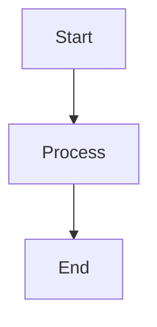

# ブログ記事執筆規約

## フロントマター必須項目

すべてのブログ記事には以下のフロントマターが必須です:

```yaml
---
title: '記事タイトル'
description: '記事の説明 (120文字以内推奨)'
publishedAt: '2025-03-20'
status: 'published'  # または 'draft'
tags: ['tag1', 'tag2']
---
```

## タグの追加

タグは `src/config/tag-slugs.ts` に定義済みのもののみ使用可能です。新しいタグを追加する場合:

1. `src/config/tag-slugs.ts` にタグIDと表示名を追加
2. 記事のフロントマターに追加: `tags: ["new-tag"]`
3. `bun run check:tags` で整合性を確認 (commit時に自動検証)

## コードブロック

コードブロックは必ず言語指定を付けてください:

````markdown
```typescript
function example() {
  // ...
}
```
````

## Mermaid図

フロー図・シーケンス図は Mermaid 記法を使用します:

````markdown

````

## リンクプレビュー

外部URLは自動的にカード形式で表示されます。特別な記法は不要です:

```markdown
https://example.com
```

## ファイル名規則

ブログ記事のファイル名は以下の形式に従います:

```
YYYY-MM-DD_title-slug.md
```

例: `2025-03-20_nextjs-app-router.md`

## 画像の配置

画像は `/public/images/blog/` に配置し、記事から相対パスで参照します:

```markdown

```
