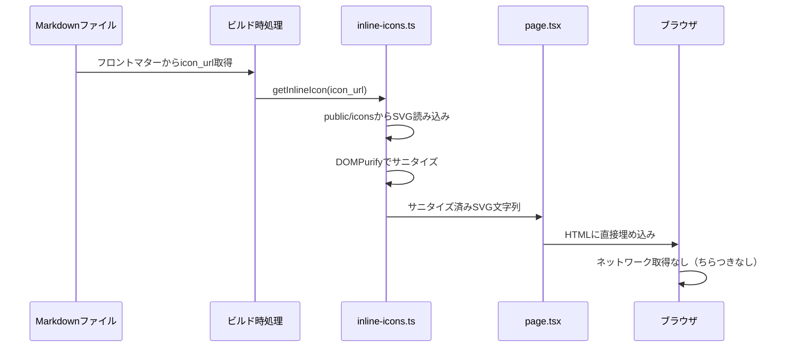

## はじめに
私のブログでは、絵文字を「Fluent Emoji」という、Windows などで採用されている絵文字デザインに変換してトップページに使用しています。特に深い理由があるわけではないのですが、iPhone のデフォルト絵文字よりも Windows 側の絵文字の方が可愛いからです。
以前、このブログで「iPhone でも Windows と同じように絵文字を表示したい」という記事を投稿しました。

https://suntory-n-water.com/blog/ios-kawaii-emoji

その記事からの再度の引用になりますが、絵文字というものは Unicode で規定されているものの、表示する媒体によってある程度の「表現の幅」が認められています。例えば、同じ「サングラスをした顔」であっても、Windows と Apple の絵文字ではデザインが異なります。

https://0g0.org/unicode/1F60E/

これまでは、ブログで絵文字を採用する際に GitHub 上にある静的ファイルを直接 URL で指定し、Next.js の Image タグで取得していました。例えば同じ「サングラスをした顔」であれば `https://raw.githubusercontent.com/microsoft/fluentui-emoji/main/assets/Smiling%20face%20with%20sunglasses/Flat/smiling_face_with_sunglasses_flat.svg` という URL で絵文字を取得できます。

しかし、このような実装では初回アクセス時に限り、絵文字が表示されるまでに若干のちらつきが発生していました。2 回目以降はキャッシュが効いてスムーズに表示されるのですが、初回はページの描画と画像の読み込みタイミングがずれることで、一瞬空白が表示されてしまいます。

こういった「ちらつき」は、サイトの UX に大きく関わってきます。個人で運営している Web サービスであればまだ許容できるかもしれませんが、実際のプロダクトで頻繁にちらつきが起こると非常に気になるものです。

私自身、実務でも同様の経験がありました。大規模な基幹システムの開発において、ボタン押下後にフォーカスが一瞬消えるなど、バグとは言えないものの微妙に違和感を覚えるような挙動を、ユーザーから指摘されることがありました。こうした細かい点も積み重なると「良いユーザー体験」とは言えません。

この記事では、こうした画像取得時のちらつき問題をどのように解決したかを紹介していきます。

## 試行錯誤と原因調査
一番手っ取り早い方法として静的ファイルをローカルにダウンロードして読み込むことが考えられます。「外部からの fetch に時間がかかるのであれば、Next.js の `public` フォルダから静的ファイルとして配信すればネットワークラグもなく解決するのではないか」と考えました。

しかし、ローカルに配置したにもかかわらず、依然としてちらつきは解消されませんでした。

原因を調べたところ、Next.js の `<Image>` コンポーネントはデフォルトで遅延読み込み (lazy loading) が有効になっており、ネットワーク経由で画像を取得する仕組みになっていることが判明しました。

https://nextjs.org/docs/app/getting-started/images

そのため、ローカルの `public` フォルダに配置した静的ファイルであっても、初回アクセス時にはネットワーク取得のラグが発生し、それがちらつきの原因となっていました。
Next.js 公式の Issue を見ると `<Image>` コンポーネント使用時の flicker (ちらつき) が報告されており、特に SVG 画像でこの現象が顕著に現れることが知られています。

https://github.com/vercel/next.js/issues/63681

https://nextjs.org/docs/app/api-reference/components/image#dangerouslyallowsvg

## SVGインライン化による解決
「どうにかならないか」と考えた末、React の場合は実際の SVG コードを直接ソースコードに埋め込む方が、ほぼ確実にちらつきを防げることに気づきました。

SVG をインライン化（コード中に直接埋め込み）することで、ネットワーク経由の画像取得プロセスをスキップできます。ビルド時に静的ファイルの中に SVG コードそのものを含めてしまえば、画像のロードを待つ必要がなくなり、初回表示時からちらつくことなく表示されます。SVG は React のコンポーネントとして作成し、ビルド時に静的ファイルとして配信することで、ネットワークリクエストをなくし、ちらつきをなくす強引な手段で実装しました。

<!-- textlint-disable preset-ja-technical-writing/no-unmatched-pair -->
>[!CAUTION]
>SVGを動的に書き換えるためには `dangerouslySetInnerHTML` などを使用する可能性があるため、XSSのリスクがあります。
>使用するときは `DOMPurify` ライブラリなどで必ずサニタイズを行ってください。
>
>https://github.com/cure53/DOMPurify
>
<!-- textlint-enable preset-ja-technical-writing/no-unmatched-pair -->

### 実装の流れ

SVG インライン化は以下の流れで処理されます。

1. Markdown ファイルのフロントマターから `icon_url` フィールドを取得。
2. `getInlineIcon(icon_url)` を呼び出し、`public/icons` ディレクトリから SVG ファイルを同期読み込み。
3. 読み込んだ SVG を DOMPurify でサニタイズし、XSS 攻撃のリスクを除去。
4. サニタイズ済みの SVG 文字列を `dangerouslySetInnerHTML` で HTML に直接埋め込み。
5. ビルド済み HTML に SVG が含まれているため、ネットワーク取得なしで即座に表示。



ブログ記事は全て Markdown ファイルのフロントマターで定義しています。
本ブログでは `icon` を元に `Fluent Emoji` を Fetch して `icon_url` に設定し、表示したいアイコンのパスへ変換する処理を自動で行っています。

```yaml contents/blog/2025-11-23_annoying-flickering-blog-svg-icon-fix.md
---
title: ブログのSVGアイコンがチラついてムカついたのでやったこと
slug: annoying-flickering-blog-svg-icon-fix
date: 2025-11-23
description: Next.jsのImageコンポーネントで発生するSVGアイコンのちらつき問題を、SVGインライン化によって解決した実装記録です。
icon: 💥
icon_url: /icons/collision_flat.svg
tags:
  - 絵文字
  - React
  - SVG
  - Next.js
---
```

`icon_url` に指定したパス（`/icons/collision_flat.svg`）は、`public/icons/` ディレクトリ配下に配置します。

従来の実装では、Next.js の `<Image>` コンポーネントで外部 URL または public フォルダから画像を取得していました。SVG インライン化した実装では、ビルド時に SVG を読み込み、`dangerouslySetInnerHTML` で直接埋め込みます。
```tsx src/app/blog/[slug]/page.tsx
// Before: Imageコンポーネントで画像取得（ちらつきあり）
import Image from 'next/image';
import { getBlogPostBySlug } from '@/lib/markdown';

interface BlogPostPageProps {
  params: Promise<{ slug: string }>;
}

export default async function BlogPostPage({ params }: BlogPostPageProps) {
  const { slug } = await params;
  // ブログ記事をslugで取得する関数（フロントマターとMarkdown本文を含む）
  const post = await getBlogPostBySlug(slug);

  // フロントマターからアイコンURLを取得
  const displayUrl =
    post.metadata.icon_url ||
    (post.metadata.icon?.startsWith('https://') ? post.metadata.icon : null);

  return (
    <div className='mb-6 flex justify-center'>
      {displayUrl ? (
        <Image
          src={displayUrl}
          alt={`Icon for ${post.metadata.title}`}
          width={80}
          height={80}
        />
      ) : (
        <div className='text-6xl'>{post.metadata.icon}</div>
      )}
    </div>
  );
}
```


```diff src/app/blog/[slug]/page.tsx
 // After: SVGインライン化（ちらつきなし）
 import Image from 'next/image';
+import { getInlineIcon } from '@/lib/inline-icons';
 import { getBlogPostBySlug } from '@/lib/markdown';

 interface BlogPostPageProps {
   params: Promise<{ slug: string }>;
 }

 export default async function BlogPostPage({ params }: BlogPostPageProps) {
   const { slug } = await params;
   // ブログ記事をslugで取得する関数（フロントマターとMarkdown本文を含む）
   const post = await getBlogPostBySlug(slug);

   // フロントマターからアイコンURLを取得
   const displayUrl =
     post.metadata.icon_url ||
     (post.metadata.icon?.startsWith('https://') ? post.metadata.icon : null);

+  // ビルド時にpublic/iconsからSVGを読み込み
+  const inlineSvg = displayUrl ? getInlineIcon(displayUrl) : undefined;

   return (
     <div className='mb-6 flex justify-center'>
-      {displayUrl ? (
+      {inlineSvg ? (
+        <span
+          className='h-20 w-20 [&>svg]:h-full [&>svg]:w-full [&>svg]:object-contain'
+          aria-hidden
+          dangerouslySetInnerHTML={{ __html: inlineSvg }}
+        />
+      ) : displayUrl ? (
         <Image
           src={displayUrl}
           alt={`Icon for ${post.metadata.title}`}
           width={80}
           height={80}
+          priority
+          unoptimized
         />
       ) : (
         <div className='text-6xl'>{post.metadata.icon}</div>
       )}
     </div>
   );
 }
```

先述した通り、セキュリティ対策として、DOMPurify ですべての SVG をサニタイズしています。

```ts src/lib/inline-icons.ts
import DOMPurify from 'dompurify';
import { JSDOM } from 'jsdom';

// Node.js環境でDOMPurifyを初期化
const window = new JSDOM('').window;
const purify = DOMPurify(window);

/**
 * SVGをサニタイズしてXSS攻撃を防ぐ
 * script要素、onload/onerror等のイベントハンドラを除去
 */
function sanitizeSVG(svg: string): string {
  return purify.sanitize(svg, {
    USE_PROFILES: { svg: true, svgFilters: true },
    ADD_TAGS: [
      'svg',
      'path',
      'circle',
      'rect',
      'line',
      'polyline',
      'polygon',
      'g',
      'defs',
      'use',
    ],
    FORBID_TAGS: ['script', 'iframe', 'object', 'embed'],
    FORBID_ATTR: ['onerror', 'onload', 'onclick', 'onmouseover'],
  });
}
```

### 変更後の確認

実際に両方の実装を比較してみましょう。

まず、従来通り URL で画像を指定した方式です。初回起動時や `Command + Shift + R` などでスーパーリロードした時には、コンマ数秒程度ではありますが、ちらつきが発生します。2 回目以降、同じ URL の絵文字を表示する際にはちらつきませんが、初回のこの挙動は依然として気になります。


一方、SVG をビルドに直接埋め込む方式ではどうでしょうか。ローカル環境ではなく、Vercel 上にデプロイされた環境で検証しましたが、確認できる限りちらつきは発生していません。実際のソースコードを確認すると、該当の SVG 部分には SVG コードが直接埋め込まれていることが分かります。


## まとめ

- Next.js では画像の最適化に関する設定は豊富に用意されているが、SVG の最適化方法については記載がない。
- `public` フォルダに配置してもネットワークリクエストが発生するため、初回のページ読み込みではちらつきが発生する。
- SVG 自体をビルド時に静的ファイルとして読み込むことで、初回ページ読み込みのちらつきをなくすことができる。
- 埋め込む場合は SVG をインライン化することから、XSS のリスクがあるため適切にサニタイズを行いセキュリティリスクを排除する。

## 参考

https://zenn.dev/catnose99/articles/547cbf57e5ad28

https://zenn.dev/nawomat/articles/4626a539be00dd

https://qiita.com/kensiiwasaki/items/deb6d2ab6ba6b20308b6