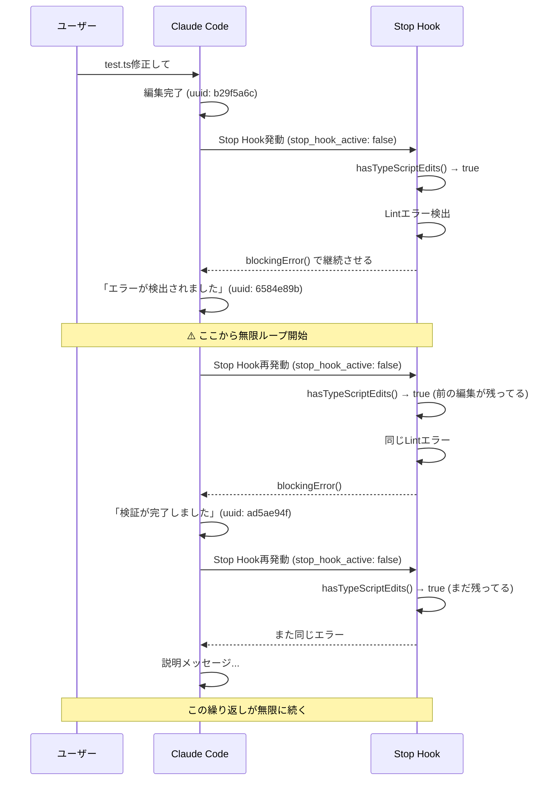

2025 年 12 月現在、私たちのコーディング環境は過去に戻れないほどの劇的な変化を遂げました。それは Claude Code といった**コーディングエージェント**の登場です。
コーディングエージェントの衝撃を表した記事 [CLINEに全部賭けろ](https://zenn.dev/mizchi/articles/all-in-on-cline)では「***Cline は真のイノベーションの入口であり、そして開けてはいけないパンドラの箱でもあったと思う。***」と語られています。その中でも現時点でシェア率が一番高いのは Claude Code でしょう。
かつて GitHub Copilot が担っていた「IDE 上の補佐役」という地位は、ターミナルで直接シェルを操作する Claude Code へと移り変わりました。この圧倒的なスピード感と全能感に一度慣れてしまうと、もはや昨年の開発スタイルを思い出せないほどです。正直な話、私も昨年どんなふうに開発をしていたのか全く覚えていません。今思えばよく Claude Code 無しで開発できたな…と思ってしまうくらいのインパクトです。微細な修正から大規模なリファクタリングまで、人間が手を動かすよりも AI に任せた方が、遥かに正確で、何より速い。それが今の私たちの「当たり前」になりつつあります。

## AI に「ルールを覚えておいて」が通用しない理由

しかし、この快適な開発体験は長くは続きません。開発が進みセッションが長期化すると、AI は「コーディング規約をうっかり忘れる」という致命的な問題に直面します。

少しスケールが大きい話になってしまいますが、人間社会においてルールや法律が機能するのはなぜでしょうか。それは、ルールを破った際の罰則や、それを取り締まる警察という強制力、極端な言い方をすれば「**暴力装置**」が存在するからです。

同じことがシステム開発の現場にも当てはまります。ドキュメントの記述だけでは、秩序は保たれません。これは AI も同様です。メモリファイルである `CLAUDE.md` に「any 型は禁止」「関数の引数が 2 個以上あるときにオブジェクト形式にする」といくら記述しても、強制力がなければ、その指示はいずれ忘れて守られなくなります。

私は Claude Code を Pro プランで契約しているため、その都度チャットで「ルールを守って」と指摘するのは、貴重なトークンとコンテキストウィンドウの浪費でしかありません。一方で、AI の成果物を人間が逐一レビューし修正するのは、「開発効率を上げる」という本来の目的と矛盾します。

Claude Code の書き方を指摘した記事、[Writing a good CLAUDE](https://www.humanlayer.dev/blog/writing-a-good-claude-md) では、「***LLM に自然言語でルールを詰め込みすぎると、かえって全体のパフォーマンスが下がる***」という構造的な限界も指摘されています。つまり、AI に「ルールを覚えておいて」と頼むこと自体が、エンジニアリングのアプローチとして間違っているのです。

では、AI の記憶力にも、人間のレビューにも頼らず、「ルールを守らざるを得ない環境」を作るにはどうすればよいのでしょうか。
答えは、AI に対する**暴力装置**、すなわち**静的解析による自動検知**の実装です。

## Claude Code Hooks と Biome v2 による自動修正の仕組み

Claude Code には、処理の実行前やツールの実行後に任意のコマンドを強制実行できる Hooks という機能があります。本記事では、この Hooks を活用し、Claude Code がコードを書いて作業を停止したあとに Biome v2 による静的解析を走らせ、違反があれば「自身に修正させる」というフローを作成していきます。

Biome v2 では、カスタムルールを記述できるため、プロジェクト固有の複雑な制約も自動検証できるようになりました。これにより、従来のリンターでは実装できなかった「オレオレルール」を機械的に定義することが可能になります。
よろしければ、以前書いたこちらの記事を見てください！

https://suntory-n-water.com/blog/delegate-coding-rules-to-biome

Hooks の中でも Stop Hooks は、Claude Code がファイルを編集した直後に任意のコマンドを自動実行できる仕組みです。この仕組みにより、コード作成と検証のサイクルを人間の介入なしで自動化できます。

この仕組みのメリットは、明確なエラーログによるフィードバックにあります。以前は、「関数の引数が 2 個以上あるときにオブジェクト形式にしてください」といった指示を自然言語で何度も繰り返す必要がありました。しかし、Biome v2 のカスタムルールでこれを定義すれば、Claude Code はエラー内容に基づいて修正を開始します。曖昧な自然言語の指示よりも、機械的なエラーログの方が圧倒的に効率が良いです。

ただし、ここで注意が必要です。単に `tsc` や `lint` といったコマンドを Hooks に組み込むだけでは、大量のエラーログが Claude Code にとってのノイズとなり、かえって混乱を招くだけです。Claude Code が効率的に修正できるよう、エラー出力を最適化し、必要な情報だけを提示する「Stop Hooks」の設計が重要になります。

## 初期実装から見えた課題

まずはシンプルに、TypeScript のファイルが編集されたら型チェックを実行するという Stop Hooks を作成しました。この内容は以前、参考記事や私のブログで紹介したもので、これにより単純な型エラーの見落としは防げるようになりました。
こちらもよろしければ、見てください！

https://suntory-n-water.com/blog/dont-forget-check-typescript-types-stop

しかし、この仕組みを実務レベルで運用し始めると、すぐに改善点が見えてきました。主な問題は 2 つあります。

1 つ目は、**型チェック以外にも様々なチェックを実行したい**という点です。コード品質を保つためには、フォーマッターやリンター、型チェック、テストなど様々な検証が必要になります。型チェックは手っ取り早く実装できましたが、実際のプロジェクトでは、当然フォーマットやリンター、テストなども実行したいはずです。これらを個別の設定ファイルに記載していくと、設定ファイルである `settings.json` の設定が肥大化し、かえって管理コストが増大します。

2 つ目は、**エラー出力に無駄な情報が多すぎる**という点です。型チェックやリントのエラーメッセージは、人間が読むために設計されています。そのため、色付けや装飾、補足情報が多く含まれており、これをそのまま AI に渡すと、エラーの本質以外の情報でコンテキストウィンドウが埋まってしまいます。以前作った Stop Hooks では、このフィルタリングが不十分だったため、大量のノイズが Claude Code に送られていました。

正直なところ、AI にとって必要なのは「どのファイルの何行目で、どういったエラーが起きているか」という情報だけです。AI はそこから処理を開始するため、不必要な情報は極力排除したほうが、トークンの削減につながります。

これらの経験から、人間用に設計された CLI ツールをそのまま AI に繋ぐだけでは不十分だと分かりました。人間にとって親切な色付けや詳細な説明は、AI にとってはノイズでしかありません。複数のチェックコマンドを束ねつつ、Claude Code が修正するために必要な情報、つまりエラー箇所と内容だけを高密度に渡す仕組みが必要になります。

## 実装

実際に Hooks を作ってみましょう。今回も以前作成した時と同様に、`cc-hooks-ts` という Claude Code の出力を TypeScript で型安全に実行できるライブラリを使用して作成しました。

https://github.com/sushichan044/cc-hooks-ts

主な設計思想は以下の 2 つです。

1 つ目は、先ほど述べた通り、フォーマッター・リンター・型チェックなどを一度に行うことです。拡張性を備えるため、起動引数から実行するコマンド名を受け取る仕組みにしました。Claude Code は、実際のコマンドを利用するときに起動したディレクトリにあるスクリプトを実行可能です。

https://code.claude.com/docs/en/hooks

例えば、プロジェクト A で package.json に format というスクリプトがあれば、そこで起動した Claude Code が format に書いてあるコマンドを実行できます。そのため、今回の実装では、package.json にあるコマンドの名称を起動引数で設定して、複数のコマンド実行が可能なように設計しました。

2 つ目は、Claude Code へ必要な情報だけを渡すことです。先ほど述べた通り、通常のコマンドは人間用に作られているため、無駄な情報、例えば色付けやエラーが起きたコードの実際の行数などを視覚的にわかりやすく表示しています。
しかし、これらは AI にとってトークンを無駄に消費するノイズです。そのため、エラーが起きている事実とその場所、内容だけを必要最小限にとどめることにしました。具体的には、Biome は `--reporter=github` オプションなどを活用し、 grep コマンドを通じてエラー行やワーニング行などをピンポイントで抜き出すようにしています。これにより、不要な情報はそぎ落とし、必要な内容だけを渡すことで、Claude Code がエラーに集中して修正できる作業環境を作ることができました。

## ハマった点と解決策

ここでいくつか技術的な注意点を記載します。具体的には以下の 2 つです。

1 つ目は、**Stop Hooks が無限ループしてしまう**ことです。例えば、あらかじめエラーになるコードを用意し、「修正せず、確認だけにしてください」と指示した場合を考えてみます。すると、エラーが起きた→コードを作成する→エラーが起きる→Stop Hooks が実行される→Claude がエラーが起きてますと報告する→また Stop Hooks が起こる、といった具合にエラーの内容が延々と繰り返され、Claude Code がどうしようもなくなってしまいます。

作業指示が与えられていないのにエラーが出ているから作業しなければいけない、という状態のがんじがらめになってしまうのです。

私が以前作成した Hooks では、最新のユーザー発言以降に編集があったかをチェックしていました。

https://github.com/Suntory-Y-Water/claude-code-settings/blob/main/scripts/typescript/utils.ts#L90-L137

しかし、そもそも Claude Code が「分かりました」とエラーがあっても作業を停止しなかった場合、その返答も最新のユーザー発言以降に含まれてしまうため、さきほどの編集を再検知してしまい、永遠に Hooks が発動し続ける状態になりました。
これを解決するためには、Claude Code が提供している「現在 Hooks の割り込み中か」を表す `stop_hook_active` フラグがあるため、これを呼び出しの最初に確認することで、Hook でエラーが報告済みだった場合はスキップするようにしています。

https://code.claude.com/docs/en/hooks#stop-and-subagentstop-input

2 つ目は、**パイプ処理によってエラーが消えてしまう**ことです。明らかにリントエラーが発生するコードを作成したのに、Hooks が成功と判定され、Claude Code がそのまま処理を進めてしまうことが発生しました。
これは本当に基本的な話なのですが、出力フィルタリングの時に書いた grep のパイプ処理が原因です。
そのときのコマンドは `biome check . --reporter=github 2>&1 | grep '^::'` となっていたため、Biome がコードにエラーがあって EXIT コード 1 を返却しても、後ろの grep がエラー行を見つけて正常終了してしまうと、Bash の仕様で全体の終了コードが 0=成功となってしまうのです。
解決策として、`set -o pipefail` をコマンドの先頭に付与して、パイプラインの途中でエラーがあれば全体の終了コードをエラー(≠0)にすることで、正しくエラーを検知できました。

## まとめ

- AI にルールを「覚えておいて」と頼むだけでは、長期的にコーディング規約は守られない
- プロンプトだけでなく、Stop Hooks と静的解析による強制力が必要である
- Claude Code は Stop Hooks によって、ファイル編集後に自動でチェックを実行し、AI 自身に修正させることができる
- Biome v2 のカスタムルールを使えば、プロジェクト固有のルールも機械的に定義できる
- 人間用の CLI ツール出力をそのまま AI に渡すとノイズになるため、エラー箇所と内容だけに絞った出力設計が重要である
- 複数のチェックコマンドを統合し、必要な情報だけを渡す仕組みを作ることで、AI は効率的に修正できる

## 参考

https://www.humanlayer.dev/blog/writing-a-good-claude-md

https://code.claude.com/docs/en/hooks-guide