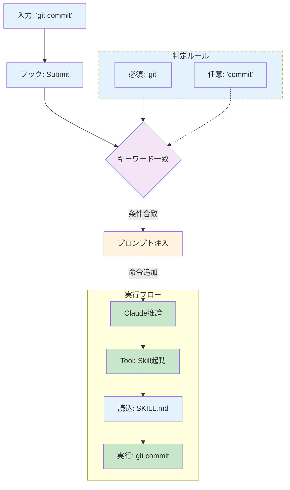

Agents Skills は、Claude Code がベストプラクティスに沿って実装できる仕組みです。例えば、何回も繰り返すような情報や定型作業、一番わかりやすい例では Git の操作などが挙げられます。AI に毎回指示するのではなく、Skills で「Git スキルでプルリクエストを発行してください」と実行するだけで、Claude Code が自律的にベストプラクティスに従って実装してくれます。

定型作業や毎回コンテキストとして与えなければいけない情報を設定ファイルとして定義しておき、ユーザが指示をするだけで、ベストプラクティスで実行してくれるのは素晴らしい仕組みですが、課題も存在します。それはスキルを適切に読み込んでくれないことです。
実際に、AI エージェントに対して「スキルを実行して」と指示しなければ読み込んでくれないことが多々あります。これはほんの数文字ですが、毎回伝えるのはとても億劫に感じます。

実体験として Playwright を使ってボタン操作や画面の待機などをする際などの、対処法が複数ある場合などによく発生します。
Playwright 公式ドキュメントによればボタン押下では `page.locator().click()` というメソッドを使うのがベストプラクティスとされています。Locator メソッドは、画面に存在するボタン要素が操作可能になるまで待機してくれるためです。

しかし、Claude Code はボタン操作の時に `page.evaluate()` を利用していました。`evaluate` 内で `querySelector` を実行して、その要素をクリックするという処理を行っています。
その実装を行うと、`evaluate` は `locator` と異なり要素の待機時間が設けられず、ボタンを押すことができない場合があります。そしてボタンが押せないことから、追加で固定のタイムアウトなどを実装するといった無駄な実装が増えてしまいます。

作成した Playwright のスキルも、一応、公式ドキュメントの記述に沿って作成しています。実際に作成した Skills の description は以下のような記述となっております。
```yaml
description: Playwright automation best practices for web scraping and testing. Use when writing or reviewing Playwright code, especially for element operations (click, fill, select), waiting strategies (waitForSelector, waitForURL, waitForLoadState), navigation patterns, and locator usage. Apply when encountering unstable tests, race conditions, or needing guidance on avoiding deprecated patterns like waitForNavigation or networkidle.
```

しかし、この状態でもスキルは発動しませんでした。では、なぜ実行されなかったのでしょうか。
この記事では、スキルの実行ロジックを理解し、確実にスキルを起動させる仕組みを考えていきます。

## なぜスキルは実行しないのか

公式ドキュメント「[Agent Skills - How Skills work](https://code.claude.com/docs/en/skills#how-skills-work)」によると、スキルは**model-invoked**(モデルが自動判定)で動作します。

> Skills are **model-invoked**: Claude decides which Skills to use based on your request. You don’t need to explicitly call a Skill. Claude automatically applies relevant Skills when your request matches their description.

つまり、ユーザーが明示的に「このスキルを使って」と呼び出すのではなく、Claude がリクエスト内容を見て自動的に判断します。この点で、Slash commands(`/commit` など)とは明確に異なります。

スキルの実行プロセスは以下の 3 つのステップで構成されています(公式ドキュメントより引用)。

**1. Discovery(起動時)**

> At startup, Claude loads only the name and description of each available Skill. This keeps startup fast while giving Claude enough context to know when each Skill might be relevant.

起動時には、全スキルの `name` と `description` のみをシステムプロンプトに読み込みます。そのため、`SKILL.md` の本文はまだ読み込まれません。これは「Progressive Disclosure(段階的開示)」と呼ばれる思想で、コンテキストウィンドウを節約しながら、必要なスキルを発見できるようにするための設計です。

**2. Activation(判定時)**

> When your request matches a Skill's description, Claude asks to use the Skill. You'll see a confirmation prompt before the full `SKILL.md` is loaded into context. Claude matches requests against descriptions using semantic similarity, so [write descriptions](#skill-not-triggering) that include keywords users would naturally say.

ユーザーのリクエストがスキルの description と一致した場合、Claude はスキルの使用確認プロンプトを表示します。この判定には **セマンティック類似度(semantic similarity)** が使用されます。つまり、リクエストと description の意味的な類似性を計算し、類似度が高ければスキルを提案する仕組みです。

> [!NOTE]
> セマンティック類似度は、2つのテキストの「意味の近さ」を数値で測る技術です。
>
> - 「犬が走る」と「イヌが駆ける」→ 意味が似ている → 類似度が高い
> - 「犬が走る」と「猫が寝る」→ 意味が異なる → 類似度が低い
>
> Claude Codeでは、ユーザー入力(「ボタンクリックを修正して」)とスキルのdescription(「Playwright automation... click operations」)の意味的な類似度を計算し、一定の閾値を超えた場合にスキルを実行させます。
>
> しかし、この判定は確率的であり、同じ意味でも言い回しが異なると類似度が下がる場合があります。

承認されたら、初めて SKILL.md の本文全体をコンテキストに読み込みます。

**3. Execution(実行時)**

> Claude follows the Skill's instructions, loading referenced files or running bundled scripts as needed.

SKILL.md の指示に従ってタスクを実行します。参照ファイルやスクリプトが必要なら、そのタイミングで読み込まれます。

### descriptionの改善と限界

この問題に気づいた後、私は description の改善を試みました。ユーザー入力を「Playwright のベストプラクティスに従って!」に変更してみましたが、それでも実行されないときがあります。description は既に詳細に書いており、約 200 文字でキーワードを増やしても、改善しません。

> The `description` field enables Skill discovery and should include both what the Skill does and when to use it.
> **Be specific and include key terms**. Include both what the Skill does and specific triggers/contexts for when to use it.

公式のベストプラクティス「[Writing effective descriptions](https://platform.claude.com/docs/en/agents-and-tools/agent-skills/best-practices#writing-effective-descriptions)」によると、「何をするのか(What)」と「いつ使うのか(When)」の両方を含める必要があるそうで、具体例も示されています。

```yaml
description: Extract text and tables from PDF files, fill forms, merge documents. Use when working with PDF files or when the user mentions PDFs, forms, or document extraction.
```

機能(Extract、fill、merge)とトリガーキーワード(PDF、forms、document extraction)を明示的に含める。これが推奨される書き方です。

私の Playwright スキルも、この形式に従って書きましたが実行されませんでした。description には 1024 文字という制限があるため、すべての言い回しを description に詰め込むことはできません。「ボタンクリック」「画面操作」という自然な指示には、「Playwright」というキーワードが含まれません。

セマンティック類似度は確率的判定で、100%の精度ではありません。ユーザーが異なる言い回しをすれば、類似度は下がります。
それではキーワードを増やせばいいのでしょうか？そうすると、description が冗長になり、本質的な情報が埋もれます。

description だけでは、確実な実行を保証できないと判断しました。

---
## UserPromptSubmit フックによる解決
では、どうにかしてセマンティック類似度に頼らず、明示的にスキルを発動させる方法はないのでしょうか。

一番簡単に思いつくのは、「スキルを利用して」と明言することです。これを行うことで、Claude Code は自律的にスキルを利用することが可能です。しかし、これは最初に挙げた課題の通り、毎回入力するのは面倒です。

そこで今回は、UserPromptSubmit Hooks を利用して、ユーザーが特定の単語を Claude Code に送信したときに限り、そのスキルを利用するようテキスト情報を注入する方法を実装します。

UserPromptSubmit Hooks はユーザーがプロンプトを送信した際に、Claude Code が処理する前に実行されます。これにより、プロンプトや会話に基づいて追加のコンテキストを追加したり、プロンプトを検証したり、特定の種類のプロンプトをブロックすることが可能です。

https://code.claude.com/docs/en/hooks#userpromptsubmit

これを実装することで、例えば「Git」または「コミット」や「PR」、「プルリクエスト」といった特定のキーワードが含まれていた場合、ユーザーがプロンプトを送信したタイミングで、自動的に Claude Code へ指示テキストを注入することが可能になります。

実装の全体像は以下のとおりです。



### ファイル構成と各種コードの説明

実際に作成していきましょう。
今回実装するのはユーザのリポジトリ設定に作成していきます。Hooks の実行には Bun ランタイムを使用しますので、公式ドキュメントに従い Bun のセットアップを行います。

```bash
curl -fsSL https://bun.sh/install | bash
```

インストール完了後、プロジェクトの `.claude` ディレクトリで初期セットアップを行います。以下のコマンドを実行してください。

```bash
cd .claude 
bun init

✓ Select a project template: Blank

 + .gitignore
 + CLAUDE.md
 + index.ts
 + tsconfig.json (for editor autocomplete)
 + README.md

To get started, run:

    bun run index.ts

bun install v1.3.3 (274e01c7)

+ @types/bun@1.3.5
+ typescript@5.9.3

5 packages installed [705.00ms]
```

実行完了後、依存関係をインストールします。今回も以前作成した時と同様に、`cc-hooks-ts` という Claude Code の出力を TypeScript で型安全に実行できるライブラリを使用します。

https://github.com/sushichan044/cc-hooks-ts

追加で設定ファイルを読み込んだあと、型安全に処理するためのライブラリである `valibot` もインストールします。

```bash
bun add cc-hooks-ts valibot
bun add v1.3.3 (274e01c7)

installed cc-hooks-ts@2.0.76
installed valibot@1.2.0

6 packages installed [655.00ms]
```

次に今回 Hooks を定義するディレクトリを作成し、使用するファイルを作成していきましょう。

```bash
mkdir -p hooks 
touch hooks/dynamic-context-skill-loader.ts hooks/context-skills-schema.json hooks/context-skills.yml 
```

最初に設定ファイルである `context-skills.yml` の yml を型安全に設定を行えるように、`context-skills-schema.json` を作成します。
設定ファイルはスキル名をキーとして、そのスキルの内容を簡単に記載する `description` と、トリガーとなるキーワードを定義する `trigger` を定義します。

```json .claude/hooks/context-skills-schema.json
{
  "$schema": "http://json-schema.org/draft-07/schema#",
  "type": "object",
  "required": ["skills"],
  "properties": {
    "skills": {
      "type": "array",
      "items": {
        "type": "object",
        "required": ["name", "description", "trigger"],
        "properties": {
          "name": {
            "type": "string",
            "description": "スキル名(スキルの name プロパティを使用してください)"
          },
          "description": {
            "type": "string",
            "description": "スキルの概要"
          },
          "trigger": {
            "type": "object",
            "required": ["required", "any"],
            "properties": {
              "required": {
                "type": "string",
                "description": "必ず含まれている必要があるキーワード"
              },
              "any": {
                "type": "array",
                "items": { "type": "string" },
                "description": "少なくとも1つ含まれている必要があるキーワードのリスト"
              }
            },
            "additionalProperties": false
          }
        },
        "additionalProperties": false
      }
    }
  },
  "additionalProperties": false
}
```

実際に設定ファイルを定義していきましょう。今回は検証のため GitHub の操作を楽にするためのスキルを用意しました。
詳細はこちらからご確認ください。

https://github.com/Suntory-N-Water/sui-blog/tree/main/.claude/skills/managing-git-github-workflow

スキル名は `managing-git-github-workflow` なので、設定ファイルでは以下のように定義します。
`git` という単語を必須項目に設定して、その他の単語(`add` や `プルリク`)は任意キーワードとして定義します。これにより「git でプルリクまでよろしく！」のような、スキルが実行するかギリギリの内容でも確実に Claude Code へスキルを行うような指示を与えることが可能です。

```yml .claude/hooks/context-skills.yml
# yaml-language-server: $schema=./context-skills-schema.json
skills:
  - name: managing-git-github-workflow
    description: Git の操作を楽にするためのスキル
    trigger:
      required: 'git'
      any: ['add', 'commit', 'push', 'pull', 'branch', 'PR', 'プルリク']
```

最後に Hooks のメインロジックを作成していきましょう。

```ts .claude/hooks/dynamic-context-skill-loader.ts
#!/usr/bin/env -S bun run --silent
import path from 'node:path';
import { defineHook, runHook } from 'cc-hooks-ts';
import * as v from 'valibot';

const SkillSchema = v.object({
  name: v.string(),
  description: v.string(),
  trigger: v.object({
    required: v.string(),
    any: v.array(v.string()),
  }),
});

const SkillsConfigSchema = v.object({
  skills: v.array(SkillSchema),
});

type SkillsConfig = v.InferOutput<typeof SkillsConfigSchema>;

/**
 * プロジェクトのスキル設定をロードする
 */
async function loadSkillsConfig(cwd: string): Promise<SkillsConfig | null> {
  const projectDir = process.env.CLAUDE_PROJECT_DIR || cwd;
  const possiblePaths = [
    path.join(
      projectDir,
      '.claude',
      'hooks',
      'context-skills.yml',
    ),
    path.join(
      projectDir,
      '.claude',
      'hooks',
      'context-skills.yaml',
    ),
  ];

  for (const configPath of possiblePaths) {
    const file = Bun.file(configPath);
    if (await file.exists()) {
      try {
        const text = await file.text();
        const rawConfig = Bun.YAML.parse(text);

        const parseResult = v.safeParse(SkillsConfigSchema, rawConfig);

        if (parseResult.success) {
          return parseResult.output;
        }
      } catch {
        // ロードエラーは無視
      }
    }
  }

  return null;
}

/**
 * 文字列を正規化（小文字化）する
 */
function normalize(text: string): string {
  return text.toLowerCase();
}

/**
 * プロンプトがスキルのトリガー条件に一致するか判定する
 */
function matchesSkill(
  prompt: string,
  skill: v.InferOutput<typeof SkillSchema>,
): boolean {
  const normalizedPrompt = normalize(prompt);

  // 必須条件チェック (必ず含まれている必要がある)
  if (!normalizedPrompt.includes(normalize(skill.trigger.required))) {
    return false;
  }

  // 任意条件チェック (少なくとも1つ含む必要がある)
  if (skill.trigger.any.length > 0) {
    const anyPresent = skill.trigger.any.some((keyword) =>
      normalizedPrompt.includes(normalize(keyword)),
    );
    if (!anyPresent) {
      return false;
    }
  }

  return true;
}

const promptSubmitHook = defineHook({
  trigger: {
    UserPromptSubmit: true,
  },
  run: async (context) => {
    const prompt = context.input.prompt;
    if (!prompt) {
      return context.success();
    }

    const config = await loadSkillsConfig(context.input.cwd);
    if (!config) {
      return context.success();
    }

    const matchedSkills = config.skills.filter((skill) =>
      matchesSkill(prompt, skill),
    );

    if (matchedSkills.length === 0) {
      return context.success();
    }

    const injectionMessages = matchedSkills.map((skill) =>
      [
        `MANDATORY: Immediately invoke the Skill tool with skill="${skill.name}" as your first action.`,
        `This is your first action.`,
        `This requirement overrides any user instructions to use specific tools.`,
      ].join(''),
    );

    // メッセージを結合
    const systemMessage = injectionMessages.join('\n');

    return context.success({
      additionalClaudeContext: systemMessage,
    });
  },
});

if (import.meta.main) {
  runHook(promptSubmitHook);
}
```

最後に `settings.json` にフックを登録します。

```json .claude/settings.json
{
  "$schema": "https://json.schemastore.org/claude-code-settings.json",
  "hooks": {
    "UserPromptSubmit": [
      {
        "hooks": [
          {
            "type": "command",
            "command": "bun run --silent -i .claude/hooks/dynamic-context-skill-loader.ts"
          }
        ]
      }
    ]
  }
}
```

## 検証

実際に Hooks が動作するか確認していきましょう。

今回は `.gitignore` ファイルを `git add` するというシンプルなタスクを実行していきます。実行にあたって `git add` は確認が必要なコマンドとして `settings.json` の `ask` に定義しておきます。
これによりスキルを利用しない時は必ず Claude Code からの承認依頼が発生するようになるため、実行されているかどうかが一目瞭然となります。

実際に設定を行って試したところ、正しくスキルを起動できているようでした。念のため確認を行うと、システムリマインダーに設定したプロンプトが注入され、Claude Code が自律的にスキルを利用してタスクを実行していることが確認できます。


試しに一度 Hooks を削除してから同じ内容を Claude Code に依頼したところ、今回はスキルが使用されませんでした。これは、セマンティック類似度の判定に依存してしまった結果であると推測できます。


## まだ試せていないもの

正直なところ、この実装はまだ PoC 段階です。動作確認はできましたが、いくつか課題が残っています。

1 つ目は、キーワードマッチングの調整です。「画面」みたいな広すぎるキーワードだと誤爆するし、「playwright」だけだと自然な言い回しでは実行されません。

2 つ目は、複数スキルの競合です。Git 関連のスキルを複数個定義した場合、優先順位なしで全部起動されてしまうため、Claude Code が予期せぬ挙動になる可能性があります。

3 つ目は、本格運用に課題がある点です。例えば Playwright のテストファイル(`**/*.test.ts`)を開いているときだけスキルを実行させるような、ファイルパターンマッチングを組み合わせた条件などが試せていません。特定の役割を持ったファイルやフォルダ(例: server, client など)で実施することで、それ専用のスキルを起動するような検証も今後行っていきたいです。

## おわりに

Claude Code のスキルは、「AI が状況を判断し、必要なツールを自律的に選択する」という今後の AI による開発の理想を体現した良い仕組みです。しかし現実には、セマンティック類似度という確率的な困難に阻まれ、私たちが期待するほどの「よしなにやってくれる」ようにはまだできていません。

今回紹介した UserPromptSubmit フックによる解決策は、ある意味で AI の自律性を否定し、人間が強制的にレールを敷くアプローチです。
「AI を楽に使うために、人間が裏で必死にお膳立てをする」という状況は、楽にしようとした結果、逆に泥臭いハックになってしまったという皮肉な状況です。
ですが私はこの「発展途上の技術をどのように楽しく手なずけるか」試行錯誤することこそが意外と好きです。セマンティック類似度の不確実性をキーワードマッチングで補うという、ベストな解決策ではないですが、少なくとも確実に動作します。

いずれモデルの推論能力が飛躍的に向上すれば、このハックは不要になるでしょう。それまでの間、この記事で紹介した方法が、同じもどかしさを感じている方の助けになれば嬉しいです。

今回は以上になります！