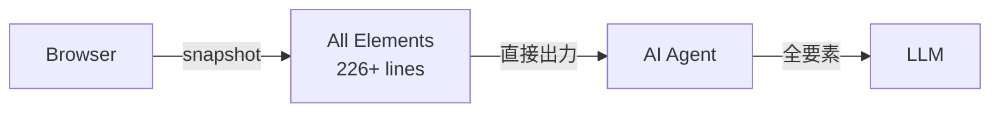
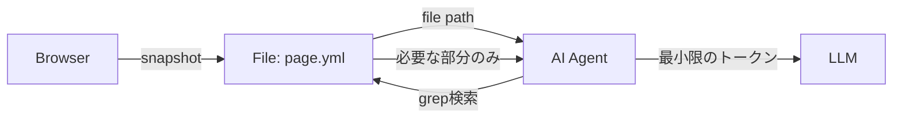

AIエージェントによるブラウザ自動操作は、2025年3月にMicrosoftが公開したPlaywright MCPによって可能になりました。AIがブラウザを操作し、ページの状態を確認しながら次の操作を決定するというしくみです。しかし、Playwright MCPにはページのスナップショット全体をAIに送信するため、トークン消費量[^token]が膨大になるという課題がありました。

この課題を解決するため、2026年1月にVercelがagent-browserというCLIツールを公開しました。agent-browserは独自の参照方式（Refs）を採用し、ページ全体ではなく必要な要素のRefと要約情報をAIに渡すことで、トークン消費量の削減を実現しています。agent-browserを使用してPlaywright MCPと比較検証した結果、約70%のトークン削減に成功しました。詳細は[こちらの記事](https://suntory-n-water.com/blog/i-tried-using-agent-browser/)をご覧ください。

そして同じく2026年1月、Playwrightの開発元であるMicrosoftが新たにPlaywright CLIを公開しました。このツールもagent-browserと同様にCLIベースのブラウザ操作ツールですが、設計思想に違いがあります。この記事では、agent-browserとPlaywright CLIの両方を使って同じ操作を試み、設計思想の違いと実際のトークン消費量の差異を検証していきます。

## Playwright CLIのインストール

Playwright CLIの実態はPlaywright MCPです。これはnpmパッケージとして提供されているため、npmを使ってインストールできます。

```bash
npm install -g @playwright/mcp@latest
```

実際に操作するときにはagent skillsを使用するのが推奨されていますので、skillsをインストールします。
```bash
mkdir -p .claude/skills/playwright-cli
curl -o .claude/skills/playwright-cli/SKILL.md \
  https://raw.githubusercontent.com/microsoft/playwright-cli/main/skills/playwright-cli/SKILL.md
```

## Playwright CLIの使い方
Playwright CLIはagent-browserと同様に、CLIから `playwright-cli <コマンド>` の形式で使用します。
以下は `open` コマンドを使用して本ブログのトップページにアクセスするときの例です。
```bash
playwright-cli open https://suntory-n-water.com/
```
その他の要素としてPlaywrightでよく使うクリック操作や文字入力操作、関数を実行できるevalなどのコマンドが用意されています。少し特徴的だったのは、リサイズも用意されている点です。これは開発元であるPlaywrightならではのものでしょう。
```bash
playwright-cli open <url>               # open url
playwright-cli click <ref> [button]     # perform click on a web page
playwright-cli dblclick <ref> [button]  # perform double click on a web page
playwright-cli fill <ref> <text>        # fill text into editable element
playwright-cli snapshot                 # capture page snapshot to obtain element ref
playwright-cli eval <func> [ref]        # evaluate javascript expression on page or element
playwright-cli resize <w> <h>           # resize the browser window
```

## 実際にサイトへアクセスしてみる
それではPlaywright CLIを使って実際にサイトにアクセスしていきましょう。今回も以前書いた記事と同様にYahoo! JAPANへアクセスしていき、トップページにある最新のニュース1件の本文を取得してみます。

```bash
❯ Playwright CLI を使用して https://www.yahoo.co.jp/から最新のニュースを１件取得し、ニュースの詳細画面へ遷移して内容を取得してください。
```


ここで特徴的な点は、ページにアクセスすると、その時点でのスナップショットが `.playwright-cli/page-xxx.yml` にファイルとして保存されることです。エージェントへの返却はそのパスが提供されるというしくみです。
```bash
playwright-cli open https://www.yahoo.co.jp/
### Page
- Page URL: https://www.yahoo.co.jp/
- Page Title: Yahoo! JAPAN
### Snapshot
- [snapshot](.playwright-cli/page-2026-01-24T12-15-56-958Z.yml)
```
AIエージェントは大量のHTMLやref情報などを直接受け取りません。
ファイルとして出力されたものをGrep検索することで、ユーザーが実際に解決したい内容に基づいて操作を柔軟に変更します。以下のymlは実際にYahoo! JAPANへアクセスしたときのスナップショット例です。
```yml
- generic [ref=e3]:
  - complementary
  - main [ref=e129]:
    - generic [ref=e501]:
      - article [ref=e503]:
        - generic [ref=e504]:
          - tabpanel "主要" [ref=e527]:
            - heading "主要 ニュース" [level=1] [ref=e529]
            - generic [ref=e530]:
              - generic "主要 ニュース" [ref=e531]:
                - paragraph [ref=e532]:
                  - generic [ref=e533]: 1/24(土) 21:30更新
                - list [ref=e534]:
                  - listitem [ref=e535]:
                    - article [ref=e536]:
                      - text: ・
                      - link "25日大雪ピーク 交通への影響警戒 NEW" [ref=e537] [cursor=pointer]:
                        - /url: https://news.yahoo.co.jp/pickup/6567363
                        - generic [ref=e539]:
                          - heading "25日大雪ピーク 交通への影響警戒" [level=1] [ref=e540]:
                            - generic [ref=e541]: 25日大雪ピーク 交通への影響警戒
                          - generic [ref=e543]: NEW
                  - listitem [ref=e544]:
                    - article [ref=e545]:
                      - text: ・
                      - link "食料品の消費税ゼロ案 識者の疑問 NEW 232" [ref=e546] [cursor=pointer]:
                        - /url: https://news.yahoo.co.jp/pickup/6567313
                        - generic [ref=e548]:
                          - heading "食料品の消費税ゼロ案 識者の疑問" [level=1] [ref=e549]:
                            - generic [ref=e550]: 食料品の消費税ゼロ案 識者の疑問
                          - generic [ref=e552]: NEW
                          - generic [ref=e556]: "232"
```

agent-browserとの大きな違いはスナップショットの取得方法です。

まずagent-browserではスナップショットを取得した段階で、すべての要素がコンソールに直接出力されます。

```bash
agent-browser snapshot -i
- link "今すぐ設定する" [ref=e1]
- link "閉じる" [ref=e2]
- link "AIアシスタント..." [ref=e3]
… +226 lines (ctrl+o to expand)
```

agent-browserでは「ブログから最新記事のリンクだけほしい」場合でも、大量のコンテキストがエージェントに流れてしまいます。



一方、Playwright CLIではスナップショットを取得すると、エージェントにはファイルパスのみが返却されます。

```bash
playwright-cli snapshot
### Page
- Page URL: https://www.yahoo.co.jp/
- Page Title: Yahoo! JAPAN
### Snapshot
- [snapshot](.playwright-cli/page-xxx.yml)
```

AIエージェントはファイルとして出力されたものをGrep検索することで、必要な部分だけを取得します。



このように、Playwright CLIはファイルに出力した後にGrep検索するため、トークン消費量を削減できることが予測されます。

## agent-browserとトークン消費量を比較する
それではClaude Codeを使って、Playwright CLIとagent-browserの両方に同じ操作をさせてトークン消費量の差異を確認していきましょう。参考程度に実際の手順書を貼っておきます。

<details>
<summary>検証手順</summary>

````md
## 比較条件
- 同じURL(https://www.yahoo.co.jp/)にアクセス
- 最初のニュース記事をクリック
- 記事詳細ページに遷移
- 記事の全文を取得

## Playwright CLI

### 手順
1. Yahoo! JAPANを開く
```bash
playwright-cli open https://www.yahoo.co.jp/
```

2. スナップショットを取得してニュースリンクを探す
```bash
playwright-cli snapshot
```

3. 最初のニュース記事のrefを特定し、クリック(例: e547)
```bash
playwright-cli click e547
```

4. 記事詳細ページで「記事全文を読む」リンクのrefを特定し、クリック(例: e132)
```bash
playwright-cli click e132
```

5. 記事本文を取得
```bash
playwright-cli eval "document.querySelector('article')?.textContent"
```

6. ブラウザを閉じる
```bash
playwright-cli close
```

---

## agent-browser

### 手順
1. Yahoo! JAPANを開く
```bash
agent-browser open https://www.yahoo.co.jp/
```

2. スナップショットを取得してニュースリンクを探す
```bash
agent-browser snapshot -i
```

3. 最初のニュース記事のrefを特定し、クリック(例: @e100)
```bash
agent-browser click @e100
```

4. 記事詳細ページで「記事全文を読む」リンクのrefを特定し、クリック(例: @e39)
```bash
agent-browser click @e39
```

5. 記事本文を取得
```bash
agent-browser eval "document.querySelector('article')?.textContent"
```

6. ブラウザを閉じる
```bash
agent-browser close
```

---

## 注意事項

1. **ref番号の違い**: 各ツールでref番号が異なるため、実際のスナップショット結果を確認して正しいrefを使用してください
3. **eval実行**: 両方とも同じJavaScriptコードを使用して記事本文を取得してください
````

</details>

最終的な結果は以下のとおりです。予想通りagent-browserと比較して40%ほどトークン消費量が少ない結果となりました。これは設計思想の違いによってもたらされた結果だといえます。

| ツール | 総トークン使用量 | 差分 | コンテキスト量 |
|-------|----------------|------|--------------|
| Playwright CLI | 24.7K | - | 15% |
| agent-browser | 34.4K | +39.3%増 | 21% |

各ツール仕様時の詳細なログは、こちらをご覧ください。

<details>
<summary>Playwright CLI</summary>

```bash
⏺ Yahoo! JAPANにアクセスし、ニュース記事の本文を取得する作業を開始します。

⏺ Bash(playwright-cli open https://www.yahoo.co.jp/)
  ⎿  ### Page
     - Page URL: https://www.yahoo.co.jp/
     - Page Title: Yahoo! JAPAN
     … +6 lines (ctrl+o to expand)

⏺ Bash(playwright-cli snapshot)
  ⎿  ### Page
     - Page URL: https://www.yahoo.co.jp/
     - Page Title: Yahoo! JAPAN
     … +4 lines (ctrl+o to expand)

⏺ Bash(playwright-cli click e547)
  ⎿  ### Page
     - Page URL: https://news.yahoo.co.jp/pickup/6567313
     - Page Title: 食料品の消費税ゼロ案 識者の疑問 - Yahoo!ニュース
     … +6 lines (ctrl+o to expand)

⏺ Bash(playwright-cli snapshot)
  ⎿  ### Page
     - Page URL: https://news.yahoo.co.jp/pickup/6567313
     - Page Title: 食料品の消費税ゼロ案 識者の疑問 - Yahoo!ニュース
     … +2 lines (ctrl+o to expand)

⏺ Bash(playwright-cli click e132)
  ⎿  ### Page
     - Page URL: https://news.yahoo.co.jp/pickup/6567313
     - Page Title: 食料品の消費税ゼロ案 識者の疑問 - Yahoo!ニュース
     … +2 lines (ctrl+o to expand)

⏺ Bash(playwright-cli eval "document.querySelector('article')?.textContent")
  ⎿ ### Result
    "食料品の消費税ゼロ案 識者の疑問1/24(土) 15:07ABEMA TIMES2026年衆議院選挙「食料品の消費税ゼロ」で本当に国民は救
    われる？経済専門家が指摘する疑問点の数々「説得力のある財源がない」「今、そこまで必要か」界隈では実質賃金上昇の
    見
    … +9 lines (ctrl+o to expand)


⏺ Bash(playwright-cli close)
  ⎿  ### Result
     No open tabs. Navigate to a URL to create one.

⏺ 完了

────────────────────────────────────────────────────────────────────────────────────────────────────────────────────────
❯ 
────────────────────────────────────────────────────────────────────────────────────────────────────────────────────────
  🪙 24.7K | 15%
```

</details>

<details>
<summary>agent-browser</summary>

```bash
⏺ 作業を実行します。

⏺ Bash(agent-browser open https://www.yahoo.co.jp/)
  ⎿  ✓ Yahoo! JAPAN
       https://www.yahoo.co.jp/

⏺ Bash(agent-browser snapshot -i)
  ⎿  - link "今すぐ設定する" [ref=e1]
     - link "閉じる" [ref=e2]
     - link "AIアシスタント 誰も知らない「新種の深海魚」。どんな姿か想像しよう" [ref=e3]
     … +226 lines (ctrl+o to expand)

⏺ Bash(agent-browser click @e100)
  ⎿  ✓ Done

⏺ Bash(agent-browser snapshot -i)
  ⎿  - link "世界が注目する投資家が語る「未来を動かす投資」とは？" [ref=e1]
     - link "Yahoo! JAPAN" [ref=e2]
     - link "ヘルプ" [ref=e3]
     … +103 lines (ctrl+o to expand)

⏺ Bash(agent-browser click @e39)
  ⎿  ✓ Done

⏺ Bash(agent-browser eval "document.querySelector('article')?.textContent")
  ⎿ "明日25日は大雪ピーク　日本海側を中心に大雪注意・警戒　大阪・名古屋にも雪雲流入1/24(土) 18:09配信57コメント57件
    画像：tenki.jp明日25日は大雪がピークとなり、北日本から西日本の日本海側を中心に、山沿いだけでなく平野部でも大雪
    と
    なる見込みです。また、普段、雪の少ない太平洋側でも大雪となる所があるでしょう。積雪や路面凍結による交通への影響
    … +22 lines (ctrl+o to expand)


⏺ Bash(agent-browser close)
  ⎿  ✓ Browser closed

⏺ 完了

────────────────────────────────────────────────────────────────────────────────────────────────────────────────────────
❯ 
────────────────────────────────────────────────────────────────────────────────────────────────────────────────────────
  🪙 34.4K | 21%

```

</details>


ただ気になる点として、この動向を、agent-browserが黙って見ているはずがないでしょう。OSSとして開発されている両ライブラリですが、今後のアップデートでよりAIエージェントが使いやすく、かつトークン消費量が少ないツールに進化していくことを期待します。
個人的にCLIでの操作性はagent-browserが勝っているので、そのあたりの体験も期待したいです。

## まとめ

- Playwright CLIはPlaywright MCPをベースとしたCLIでブラウザを操作するツール
- agent-browserと比較してスナップショットの撮影、要素の検索手法に設計思想の違いがある
- スナップショットをファイル出力してGrep検索したほうが、エージェントに流れるトークン消費量が少ない
- agent-browserと比較して40%ほどトークン消費量が少なかった

## 参考

https://github.com/microsoft/playwright-cli

https://github.com/vercel-labs/agent-browser


[^token]: トークンとは、AIが処理するテキストの単位で、使用量に応じて料金がかかります。トークン消費量が多いほど、処理コストと応答時間が増加します。