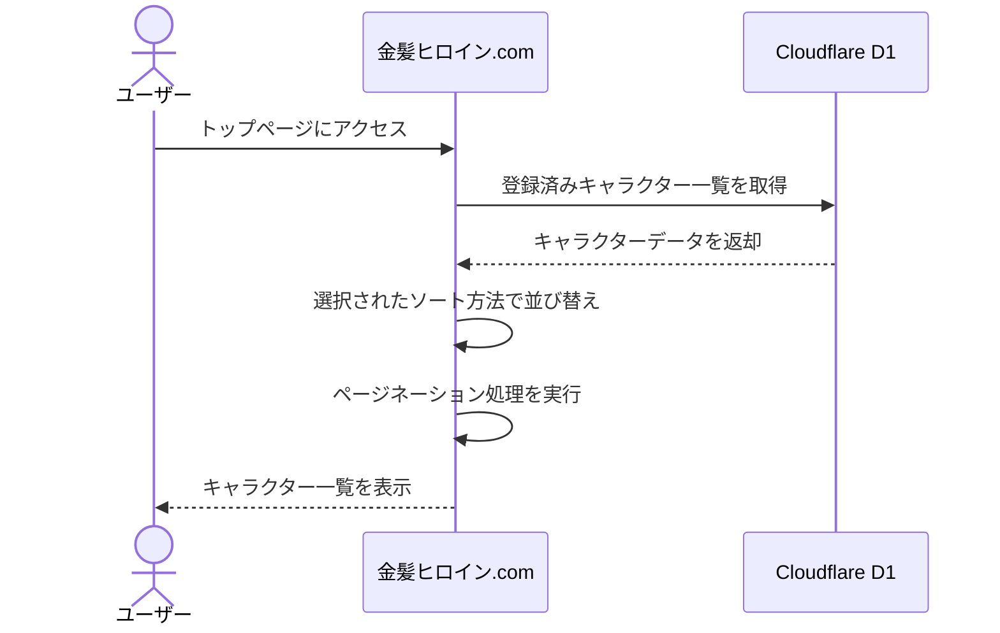
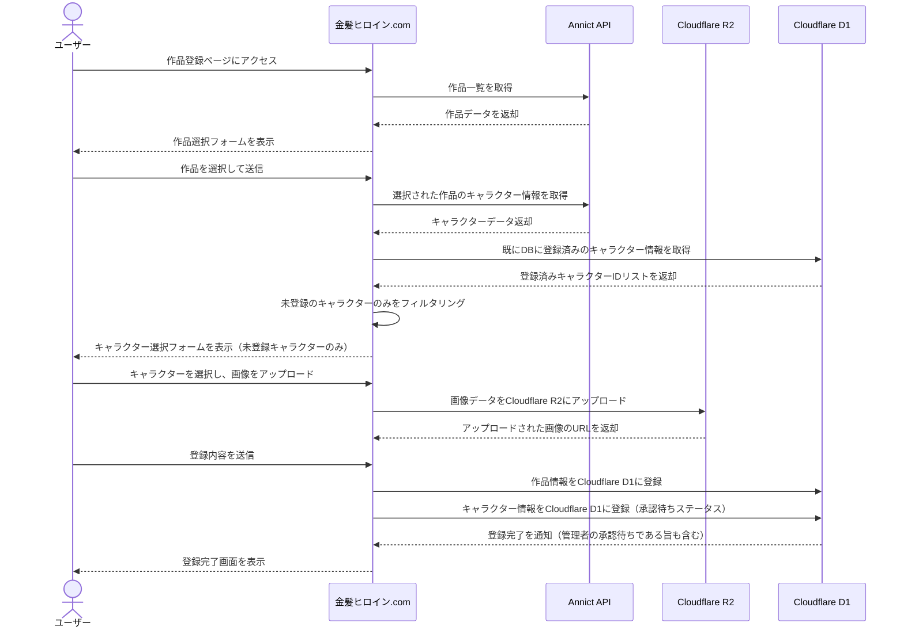
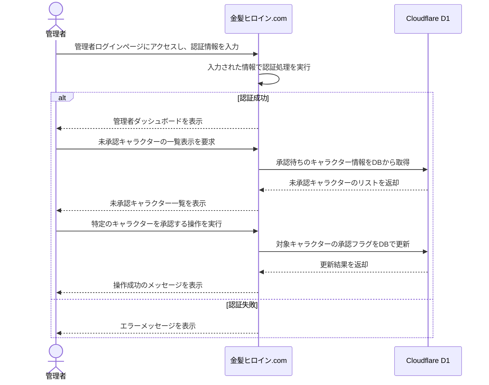
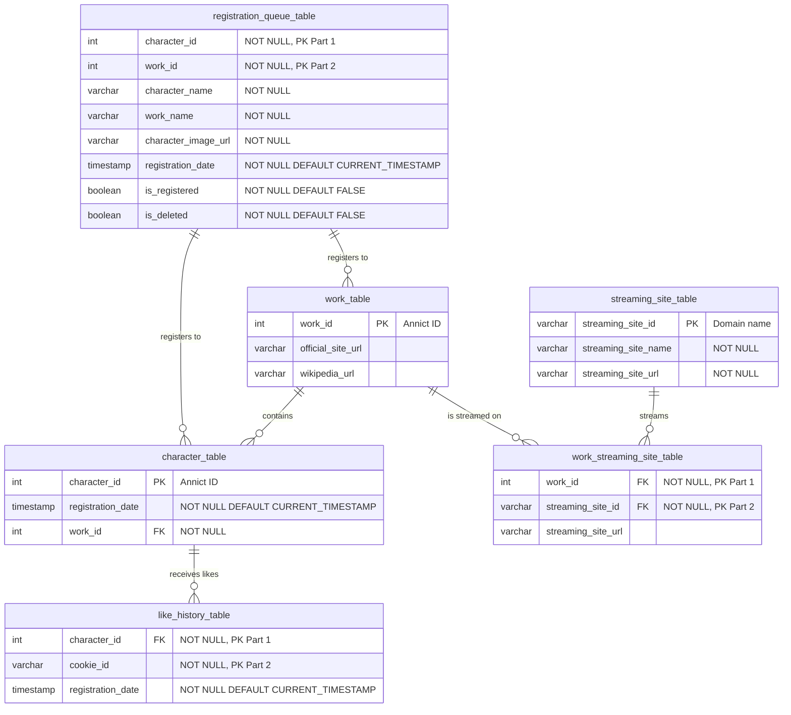

# はじめに

アニメ情報サイトは数多く存在しますが、どれも網羅性を重視しており、特定の趣味やこだわりに特化したサービスは意外と少ないと感じていました。  
私自身、金髪ヒロインが登場する作品を優先的にチェックするタイプなので、「自分のためだけの検索サイトがあれば便利なのに」と思ったのが開発のきっかけです。


↑ これをチラ見したときブチギレてしまいました。😠
既存サイトで金髪ヒロインを探しているとき、思わず「なんで一覧がないんだ！」と叫びたくなった瞬間です。

この記事では、そんな個人的なニーズを形にしたWebサイト「金髪ヒロイン.com」について、開発の背景から技術選定の理由、実装における工夫、そして今後の課題と展望までを記載していきます。

## サービス名

**金髪ヒロイン.com**

この名前は、[たまごかけごはん.com](https://xn--u8jmhc5czfqe0h.com/)さんのシンプルかつ分かりやすいネーミングに感銘を受け、参考にさせていただきました。覚えやすくて、サイトの内容が一目で伝わる点が気に入っています。

## リポジトリ

開発したソースコードは、以下のGitHubリポジトリで公開しています。

https://github.com/Suntory-Y-Water/kinpatsu-heroine-com

# サイトの使い方

「金髪ヒロイン.com」は実際にデプロイ済みですので、ぜひ一度アクセスして試してみてください。

https://kinpatsu-heroine.com/

## トップページ


トップページは、このサイトの顔となるメイン画面です。承認された金髪ヒロインたちが、見やすいカード形式で一覧表示されます。

**主な特徴は、表示順を柔軟にカスタマイズできる点です。**
「新着順」では、最近追加されたキャラクターから順に表示されるため、サイトを頻繁に訪れる方にとっては、新しい発見があるかもしれません。
「いいね順」を選択すれば、多くのユーザーから支持されている人気のキャラクターを効率的にチェックできます。
そして「ランダム表示」は、その名の通り、毎回異なる順序でキャラクターが表示されるため、偶然の出会いを楽しみたい方にぴったりの機能です。

各キャラクターカードには、画像、キャラクター名、登場作品名、そして現在の「いいね」数がコンパクトにまとめられており、一目で基本的な情報を把握できます。気になるキャラクターがいれば、カードをクリックすることで、より詳細な情報が掲載された個別ページへと遷移します。

また、スマートフォン、タブレット、PCなど、あらゆるデバイスの画面サイズに最適化されたレスポンシブデザインを採用しています。一度に表示されるキャラクターは8名で、ページ下部にあるナビゲーションボタンを使って、前後のページへと簡単に移動できます。

**ユーザーがトップページでキャラクターを閲覧する流れは、以下の通りです。**
1.  ユーザーがトップページにアクセスすると、システムは登録済みのキャラクター情報をデータベースから取得します。
2.  ユーザーは好みのソート方法（新着順／いいね順／ランダム）を選択します。
3.  気になるキャラクターのカードをクリックし、詳細ページへ進みます。



## キャラクター登録画面


「金髪ヒロイン.com」のメイン機能が、ユーザー自身がお気に入りの金髪ヒロインを登録できることです。より直感的に操作できるよう、登録プロセスは大きく2つのステップに分けています。

**ステップ1：作品の選択**
まず、登録したいキャラクターが登場する「作品」を選択します。作品名を入力し始めると、候補が動的に表示されるため、リストから該当するものを選ぶだけで完了です。


作品情報の取得には、[Annict GraphQL API](https://developers.annict.com/)を利用させていただいています。これにより、非常に多くのアニメ作品が登録対象となるはずです。
ただし、[Annict GraphQL API](https://developers.annict.com/)にキャラクター情報が登録されていない作品も存在しうるため、選択した作品に紐づくキャラクター情報が存在する場合に限り、次のステップへ進めるように制御しています。

**ステップ2：キャラクターの選択と情報入力**


次に、前の画面で選択した作品に登場するキャラクターの中から、登録したい金髪ヒロインを選びます。そして、そのキャラクターの画像をアップロードし、セレクトボックスから該当キャラクターを選択して登録ボタンを押せば、申請は完了です。

**登録されたキャラクターは、すぐに公開されるわけではありません。**
管理者が内容を確認し、承認するプロセスを挟むことで、不適切なコンテンツの掲載や重複登録、あるいは誤って金髪ヒロイン以外のキャラクターが登録されてしまう事態を防ぎます。
これにより、質の高い金髪ヒロイン情報が集まるサイトを目指しています。

加えて、ユーザー体験を損なわないよう、同じ作品に既に登録済みのキャラクターは、再度選択できないようになっています。
具体的には、キャラクター選択のセレクトボックスに表示されません。

**キャラクター登録の大まかな流れは、以下の通りです。**
1.  「ヒロインを登録する」ボタンをクリックします。
2.  作品名を検索し、リストから該当する作品を選択します。
3.  選択した作品に登場するキャラクターの中から、登録したい金髪ヒロインを選びます。
4.  キャラクターの画像をアップロードします。
5.  「登録」ボタンをクリックして申請します。
6.  管理者の承認を経て、サイトに公開されます。



## 個別キャラクター画面


各キャラクターには、専用の詳細ページが用意されており、より詳しい情報が掲載されています。

この画面の目玉機能はログインせずとも「いいね」ができることです。
アカウント登録は一切不要で、気に入ったキャラクターがいれば誰でも気軽に「いいね」を付けることができます。ただし、公平性を期すため、各ユーザーは1キャラクターにつき1回のみ「いいね」が可能です。「いいね」ボタンをクリックすると、そのキャラクターの総いいね数がリアルタイムで更新されます。
（開発初期には無限に「いいね」できる案も検討しましたが、適切な実装方法が思い浮かばず、現在の形に落ち着きました。）

さらに、キャラクター詳細ページからは、その作品の公式サイトやWikipediaへのリンク、そして利用可能な配信サービスの情報も確認できるようにしています。
これにより、気になったアニメをすぐに視聴するための手助けになれば嬉しいです✌️

## 管理画面


「金髪ヒロイン.com」の品質を維持し、ユーザーにとって快適な場所であり続けるために、管理者専用の機能群を用意しました。
管理画面へのアクセスは厳重に制限されており、事前に承認された管理者のみがログイン可能です。

管理者ログイン画面自体は非常にシンプルですが、セキュリティ対策には最低限の実装で効果があるものを入れています。
例えば、短時間に何度もログイン試行に失敗した場合、一定時間アカウントをロックするブルートフォース攻撃対策の仕組みを導入し、不正アクセスを未然に防ぎます。

管理者がログインに成功すると、まず承認待ちのキャラクター一覧が表示されます。
管理者は各キャラクターの詳細情報を確認し、サイトの趣旨に合致し、かつ情報が正確なものだけを承認します。
万が一、不適切な内容の投稿があった場合には、即座に削除することも可能です。

**管理者の承認フローは、以下のように整理できます。**
1.  管理者がログイン画面から認証情報を入力します。
2.  認証に成功すると、管理者専用のダッシュボードが表示されます。
3.  ダッシュボードで、未承認のキャラクター申請一覧を確認します。
4.  個々の申請内容を精査し、適切なものは承認、不適切なものは否認または削除します。
5.  承認されたキャラクターは、サイトのトップページなどに表示されるようになります。



# 開発にあたって

過去のWebサイト制作では、途中でモチベーションが低下したり、実現したい機能の複雑さに挫折したりすることが少なくありませんでした。
その反省を踏まえ、今回は**まずアイデアを詳細に言語化し、具体的な計画を立ててから実際の開発に着手する**ことを徹底しました。

こちらが、開発初期段階でまとめた機能案のメモです。
```
# 機能案

## どんなときに使う？

- 次に見るアニメを探しているとき。
- 「刺さる」金髪キャラクターがいないか、網羅的に確認したいとき。

## 誰が使う？

- アニメが好きで、特に金髪ヒロインに魅力を感じるすべての人。

## 使う端末は？

- スマートフォン、タブレット、PC（レスポンシブ対応）。

# 機能要件

- 登録対象は、女性の金髪キャラクターに限定する。
- アイコンには、キャラクターの顔がはっきりと表示されていること。
- 一覧ページには、キャラクターのアイコンと作品タイトルが最低限表示されていること（キャラクター名は詳細ページで確認できれば良い）。
- 作品が視聴可能でなければ意味が薄いため、一覧ページまたは詳細ページから、どの配信サービスで見られるかの情報にアクセスできること。
- どの金髪キャラクターが人気なのか可視化したいので、ユーザー登録なしで「いいね」ボタンを押せること（初期案では無限に押せることも検討したが、1ユーザー1票に変更）。
```

そして、以下が実際に作成した要件定義書の抜粋です。
これは初期の構想段階のものなので、最終的に完成したサイトの機能とは若干異なる部分もありますが、おおよそ8割方はこの定義に沿って開発を進めました。ご興味のある方はご確認ください。
:::details 構想段階
# 機能案

## どんなときに使う？

- 次に見るアニメを決めたいときに使う
- 刺さる金髪キャラがいないかを見る（実質上と同じ）

## 誰が使う？

- アニメ見たいと思っているみんな

## 使う端末は？

- SP, iPad, PC

# 機能要件

- 女性の金髪キャラ限定とする
- アイコンにキャラクターの顔が最低限表示されていること
- 一覧ページにキャラクターのアイコンが表示されていること
- キャラクターの名前は各作品ページに遷移してからわかればよいので、一覧ページでは作品タイトルが記載されていること
- 作品があったとしても、どの配信サービスでも見ることができなければ意味がないので、一覧からどの配信サービスで見れるか分かること
- どの金髪キャラ推しか分かるようにしたいのでユーザー登録なくても作品にイイネボタンがつけることができること(無限に押せてもいい。良いものは良いので）

# 思いつく課題

※ドメインがかなりニッチなのでそこから精査

- アニメタイトル情報はどこから取得するか
    - AnnictAPI
- 今季、来季など毎クールアニメがあるけどその最新化方法は？
    - ユーザーからの登録でごまかす(2024/11/21時点)
- 金髪キャラの画像とアニメの紐づけは？
    - めんどうかもしれないがユーザーからの登録でごまかす
    - AniListでキャラクターIDを指定すると画像を取得できる。アニメとの紐づけは要相談だけど、アニメID(AniList)・キャラクターID(AniList)で紐づけすればいけそう
    - ユーザーがリクエストを出して、管理画面からDBをUPDATEしたら表示されるみたいなイメージ
    - 初期データ意外はユーザー登録でやる
- 1期、2期など複数クール放送しているシリーズもので重複して登録できてしまうので、新キャラクター登録ページで1度登録したキャラクターは登録できないようにしたい

# 使用する外部APIの候補

- Annict API：アニメ情報の網羅性が高い。金髪キャラで絞ることは難しいが、アニメタイトルを特定できれば一番使用候補として高い
- AniList：認証不要でGraphQLからAPI叩けるけど金髪キャラで絞り込みを行うことはできない。他にはないジャンル分けがされているサイトなので、第二候補。キャラクターのIDで画像検索をすることができる

# 実装時の方針

- キャラクター登録時に金髪キャラに関する情報を全部DBに登録しておき、画面はDBをSELECTするだけで良い構成にする。
- 外部APIを使用するときはユーザー登録で判断できない箇所のみを設定する。
    - 例: 画像や放送サイトなど
    - アニメタイトルなどはAnnict APIから取得する

# 実装案


## 作品登録画面

初期登録で登録できなかったデータは、ユーザーからの新規で登録可能にする

理想はすでに登録されているキャラクターは登録できないようにしたい

ユーザーが画面登録するのは以下3点

- 作品名：なんの作品か特定
- キャラクター名：なんのキャラか特定
- キャラクター画像：キャラクターの画像(DBに登録するのは画像URL)は確定である想定

システムとして必要なのは以下3点

- 作品ID：なんの作品か特定
- キャラクターID：なんのキャラか特定
- キャラクター画像URL：R2ストレージにあるキャラクターの画像のURL

タスクベースUIを採用して最初に作品名を登録後、次画面でキャラクターを入力して候補を表示する

> 例 : 冴えない彼女の育てかた →澤村・スペンサー・英梨々を表示
> 

### フロー

1. 作品登録画面で登録する
2. リクエストボディに必要な情報を設定
3. 画像をよしなに処理して格納先URLを取得
4. DBに作品ID、キャラクターID、格納先URLを作成

## 管理画面

※優先度中。最初に画面表示できればよいので管理画面はあとに開発する

ユーザーから登録されたアニメ作品を本番のデータに登録する

基本的に表示する情報は同じ

- 作品名：なんの作品か特定
- キャラクター名：なんのキャラか特定
- キャラクター画像：キャラクターの画像

登録する or 削除するボタンを押せば登録 or 不要データを削除することができる

既に登録済みのキャラクターの場合は表示しないようにSQLで調整する

# 画像の取得方法

作品のティザー画像は見ることができるけど、他の情報はいらない

金髪キャラだけで埋め尽くされているのが理想

画像登録はユーザーからの登録画像のみとする

# 設計

デザインはこちらを参考

[なぜエンジニアが作る画面はダサいのか…?「理由」と「対策」を徹底解説【エンジニア向け画面デザイン講座】 - Qiita](https://qiita.com/mskmiki/items/544149987475719e417b)

## 一覧画面

パス：/

- キャラクターID、作品を紐づける、画面非表示。
- キャラクター画像、個人の識別に使う
- キャラクター名、個人の識別に使う
- Goodボタンみたいなやつ、追加実装系、優先度中
- ソートボタン(いいねが多い順だけ)　優先度中
- ページネーション、大量ページのため必要

## キャラクター詳細画面

パス：/:id

- キャラクター画像：大、個人の識別に使う
- キャラクター名：大、個人の識別に使う
- キャラクターID：大、個人の識別に使う、画面非表示
- 作品名：大、個人の識別に使う
- Goodボタンみたいなやつ：小、その他あったらいいな情報
- 公式サイト(Annictから流用)：中、情報系、更に詳細な情報がある
- Wikipedia(Annictから流用)：中、情報系、更に詳細な情報がある
- アニメサイトアイコン(どのアニメサイトで見れるか)：小、情報系、更に詳細な情報がある。アイコンの設定が面倒になる場合は固定アイコンで可とする

## キャラクター登録(作品登録)画面

パス：/register/work

- 登録フォーム
    - 作品名
    - 作品ID、画面非表示
    - 次へボタン

## キャラクター登録(作品登録)画面

パス：/register/character

- 登録フォーム
    - キャラクター名
    - キャラクターID、画面非表示
    - 画像添付ボタン
    - 登録ボタン

## 管理画面

パス：/admin

- 受付待ちリスト
    - 作品名
    - 作品ID、画面非表示
    - キャラクター名
    - キャラクターID、画面非表示
    - キャラクター画像
    - ユーザーからの登録年月日時分秒
    - 登録ボタン
    - 削除ボタン
- 要検討枠
    - 登録済みリスト一覧(内容は受付待ちリストと同じで登録ボタンと削除ボタンだけ非活性)
    - 削除済みリスト(登録済みリスト一覧と内容は同じ)

# データ設計

## エンティティ一覧

| エンティティ | 優先度 | 役割 | 備考 |
| --- | --- | --- | --- |
| 作品ID | 高 | 作品を紐づける
詳細ページで公式サイトとWikipediaの紐づけ | 登録フォームから |
| キャラクターID | 高 | 作品IDから検索して、キャラクターと紐づける | 登録フォームから |
| キャラクター画像URL | 高 | 個人の識別に使う | 登録フォームから
受付待ちリスト、登録フォームでも使用 |
| キャラクター名 | 高 | 個人の識別に使う
キャラクターIDからAPIで取得 | 受付待ちリストから
受付待ちリスト、登録フォームでも使用 |
| いいねボタン | 中 | おまけ機能、 |  |
| ページネーション | 高 | 大量ページのため必要 | 一覧画面で実装する。テーブルとしては不要 |
| 公式サイトURL | 中 | 情報系、更に詳細な情報がある
作品IDからAPIで取得 | 受付待ちリストから |
| Wikipedia URL | 中 | 情報系、更に詳細な情報がある
作品IDからAPIで取得 | 受付待ちリストから |
| アニメサイトアイコン | 中 | 情報系、配信サイトを文字ではなくアイコンにすることで押せそう感をだす | サイトIDを受付待ちリストから
APIないためデータの保持に注意が必要 |
| 作品名 | 高 | 作品を識別
作品IDからAPIで取得 | 受付待ちリスト、登録フォームでも使用 |
| ユーザーからの
登録年月日時分秒 | 高 | 登録時のタイムスタンプ |  |
| 登録ボタン | 高 | 登録処理を実行する |  |
| 削除ボタン | 高 | 登録情報を削除する |  |

# テーブル定義

## キャラクターテーブル

| カラム名 | データ型 | 制約 | 備考 |
| --- | --- | --- | --- |
| キャラクターID | INTEGER | PRIMARY KEY | AnnictのキャラクターID、キャラクターを一意に識別するキー |
| 登録日時 | TIMESTAMP | NOT NULL DEFAULT CURRENT_TIMESTAMP | 登録時のタイムスタンプ |
| 作品ID | INTEGER | NOT NULL, FOREIGN KEY REFERENCES 作品テーブル(作品ID) | キャラクターが属する作品のID |

---

## 作品テーブル

| カラム名 | データ型 | 制約 | 備考 |
| --- | --- | --- | --- |
| 作品ID | INTEGER | PRIMARY KEY | Annictの作品ID、作品を一意に識別するキー |
| 公式サイトURL | VARCHAR(2083) |  | 作品の公式サイトURL |
| Wikipedia URL | VARCHAR(2083) |  | 作品のWikipediaページのURL |

---

## 配信サイトテーブル

備考: キー重複時は更新しない

| カラム名 | データ型 | 制約 | 備考 |
| --- | --- | --- | --- |
| 配信サイトID | VARCHAR(255) | PRIMARY KEY | 配信サイトのドメイン名をIDとして使用 |
| 配信サイト名 | VARCHAR(255) | NOT NULL | 配信サイトの名前 |

---

## 作品_配信サイト紐付けテーブル

備考: キー重複時は更新しない

| カラム名 | データ型 | 制約 | 備考 |
| --- | --- | --- | --- |
| 作品ID | INTEGER | NOT NULL, FOREIGN KEY REFERENCES 作品テーブル(作品ID) | 作品を一意に識別するキー |
| 配信サイトID | VARCHAR(255) | NOT NULL, FOREIGN KEY REFERENCES 配信サイトテーブル(配信サイトID) | 配信サイトを一意に識別するID |
| 配信サイトURL | VARCHAR(2083) |  | 作品の配信URL |
| **主キー** |  | PRIMARY KEY (作品ID, 配信サイトID) | 複合主キー |

---

## いいね履歴テーブル

| カラム名 | データ型 | 制約 | 備考 |
| --- | --- | --- | --- |
| キャラクターID | INTEGER | NOT NULL, FOREIGN KEY REFERENCES キャラクターテーブル(キャラクターID) | いいね対象のキャラクター |
| Cookie ID | VARCHAR(255) | NOT NULL | クライアントを一意に識別するCookie値 |
| 登録日時 | TIMESTAMP | NOT NULL DEFAULT CURRENT_TIMESTAMP | いいねが記録されたタイムスタンプ |
| **主キー** |  | PRIMARY KEY (キャラクターID, Cookie ID) | 複合主キー |

---

## 登録待ちテーブル

| カラム名 | データ型 | 制約 | 備考 |
| --- | --- | --- | --- |
| キャラクターID | INTEGER | NOT NULL | キャラクターを一意に識別するキー |
| 作品ID | INTEGER | NOT NULL | 作品を一意に識別するキー |
| キャラクター名 | VARCHAR(255) | NOT NULL | キャラクターの名前 |
| 作品名 | VARCHAR(255) | NOT NULL | 作品の名前 |
| キャラクター画像URL | VARCHAR(2083) | NOT NULL | キャラクターの画像URL |
| 登録日時 | TIMESTAMP | NOT NULL DEFAULT CURRENT_TIMESTAMP | 登録時のタイムスタンプ |
| 登録済みフラグ | BOOLEAN | NOT NULL DEFAULT FALSE | 登録したか判断するフラグ |
| 削除済みフラグ | BOOLEAN | NOT NULL DEFAULT FALSE | 削除したか判断するフラグ |
| **主キー** |  | PRIMARY KEY (キャラクターID, 作品ID) | 複合主キー |

## ER図



# 技術選定

### フロントエンド: HonoX

触ったことがあるのと静的サイトかつSSRでバックエンドにも対応しているから

SSRに対応しておりインタラクティブな動作が少ないのと、Honoを最大限活かすことができるため

### バックエンド: Hono

HonoXに内包されているので採用

### オブジェクトストレージ: Cloudflare R2

10GBまで無料なので一択

### ホスティング: Cloudflare Workers

HonoXのデプロイ先なので一択

### データベース: Cloudflare D1

Cloudflare製品で固めたほうが色々と楽な部分が多いので確定

# IF設計

## キャラクター一覧取得

初期画面で使用する

- キャラクターID
- キャラクター画像
- キャラクター名
- 作品名
- いいね数カウント

## キャラクター詳細取得

キャラクターの詳細画面で使用する

- キャラクターID
- キャラクター名
- キャラクター画像
- 作品ID
- 作品名
- いいねボタン
- 公式サイトURL
- WikipediaURL
- 配信サイトID
- 配信サイト名

descriptionは無いキャラクターが多いので実装なし

## 作品取得

キャラクター登録画面から

※サーバーでAnnictのGraphQLを使用して、現在登録している作品情報を見て登録していない作品だけを返却する

- 作品名
- 作品ID

## キャラクター取得(作品ごと)

キャラクター登録画面から選択した作品によって表示する

※サーバーでAnnictのGraphQLを使用して、現在登録しているキャラクター情報を見て登録していないキャラクターだけを返却する

- キャラクターID
- キャラクター名

## キャラクター情報更新

キャラクター登録画面から更新する

- 作品ID
- キャラクターID
- キャラクター画像

## 登録待ちキャラクター一覧取得

管理画面から実行する

- 作品名
- 作品ID
- キャラクター名
- キャラクターID
- 登録年月日時分
- 登録済みフラグ
- 削除済みフラグ

## 登録待ちキャラクター削除

管理画面から実行する

管理画面から重複または誤った画像が使用されているキャラクターを削除する

- 作品ID
- キャラクターID
- 画像URL

## 登録待ちキャラクター更新

管理画面から実行する

管理画面から新規で追加するキャラクターを実際に使用するDBへ更新する

- キャラクターID
- キャラクター名
- 作品ID
- 作品名
- 画像URL
- 公式サイトURL（Annict GraphQLで取得）
- Wikipedia URL（Annict GraphQLで取得）
- 配信サイトURL（APIがないのでそのときにfetchしてパースする）
:::

# 技術スタック

「金髪ヒロイン.com」の技術スタックは、主にCloudflareの各種サービスで構成されています。

-   **フレームワーク**: HonoX (Hono, Vite)
-   **実行環境**: Cloudflare Workers
-   **データベース**: Cloudflare D1
-   **ストレージ**: Cloudflare R2
-   **ORM**: Drizzle ORM
-   **外部API**: Annict API (GraphQL)

## HonoX (Hono, Vite)

HonoXは「HonoとViteを組み合わせたメタフレームワーク」です。
ページごとに完全なHTMLをサーバーサイドでレンダリングするMPA（Multi Page Application）を効率的に構築するために採用しました。

「金髪ヒロイン.com」は、いわゆるWebアプリケーションというよりは、コンテンツ主体のWebサイトに近い性格を持っています。そのため、ユーザー体験を著しく損なう箇所を除き、基本的にはHonoXの設計思想に準拠した実装を心がけました。
具体的な例を挙げると、フォーム送信後の結果表示（成功メッセージやエラーメッセージなど）は、サーバー側でリダイレクト先のURLにクエリパラメータを付与し、リダイレクト先のページでそのパラメータに基づいてメッセージを出し分ける、といった古典的ですが堅実な方法を採用しています。これにより、一部の画面ではJavaScriptが無効な環境でも基本的な情報表示が可能です。
（現状では、私のスキル不足により一部で`useState`のようなクライアントサイドの仕組みを利用している箇所がありますが、将来的には全ての画面をJavaScriptオフでも完全に機能するように改修するのが目標です。）

また、HonoXはHonoをベースとしているため、Hono向けに提供されている豊富なミドルウェアやプラグインをそのまま活用できる点も大きな魅力でした。「金髪ヒロイン.com」では、具体的に以下のものを利用しています。

-   `getConnInfo()`: リクエスト元の接続情報を取得するために使用。
-   `zValidator()`: Zodを利用したバリデーション機能を手軽に導入。
-   `getCookie()`, `deleteCookie()`: クッキー操作を簡潔に記述。

## Cloudflare Workers

バックエンドのアプリケーションコードを実行する環境として、Cloudflare Workersを選択しました。これはHonoXアプリケーションの主要なデプロイターゲットの一つであり、以下のようなメリットを享受できました。

-   **サーバーレス**: サーバーのプロビジョニング、OSの管理、スケーリングといった面倒なインフラ運用作業から解放され、アプリケーションロジックの開発に集中できます。
-   **エッジコンピューティング**: Cloudflareが世界中に展開するエッジネットワーク上でコードが実行されるため、ユーザーに物理的に近いサーバーでリクエストが処理され、結果として低レイテンシな応答が期待できます。
-   **コスト効率**: 実際に処理したリクエスト数やCPU実行時間に基づいた従量課金制であり、特に個人開発のようなスモールスタートのプロジェクトでは、初期費用や固定費を大幅に抑えることができます。無料枠も充実している点は大変魅力的です。

## Cloudflare D1

データベースには、Cloudflare D1を採用しました。これはSQLiteをベースとしたサーバーレスリレーショナルデータベースです。

-   **Cloudflareエコシステムとの親和性**: Cloudflare Workersから非常に簡単にアクセスでき、複雑なネットワーク設定や認証情報の管理の手間が少ないのが特徴です。同一エコシステム内でサービスが完結するため、パフォーマンス面でも有利に働くことが期待されます。
-   **リレーショナルデータベース (RDB)**: キャラクター情報、作品情報、いいね履歴など、データ同士の関連性が高い情報を扱うため、データの一貫性を保ちやすく、柔軟なデータ操作が可能なRDBが適していました。
-   **サーバーレス**: D1もまたサーバーレスアーキテクチャを採用しており、データベースサーバーの構築や運用、スケーリングといった専門知識が求められる作業を意識する必要がありません。

## Drizzle ORM

データベースとの対話には、Drizzle ORMを使用しました。これは特にTypeScriptとの親和性が非常に高く評価されているORM（Object-Relational Mapper）です。生のSQL文字列を直接コードに埋め込む場合に比べて、より安全で保守性の高いデータベースアクセスコードを記述できます。

-   **型安全性**: データベースのスキーマ定義からTypeScriptの型情報を自動生成する機能があります。これにより、クエリを組み立てる際に型の不一致やカラム名のタイポといったミスをコンパイル時に検出でき、実行時エラーのリスクを低減します。
-   **開発効率の向上**: SQLに近い直感的な構文でクエリを記述でき、複雑なJOIN操作なども比較的容易に扱えます。また、エディタのコード補完機能も充実しており、開発の生産性向上に貢献します。

## Annict API (GraphQL)

このAPIの存在なくして、「金髪ヒロイン.com」の実現はありえませんでした。Annict APIは、アニメの作品情報やキャラクター情報を取得できるGraphQLベースのAPIです。
ユーザーが新しいキャラクターを登録する際に、正確な作品名や登場キャラクターのリストを取得するために活用しています。その他にも、公式サイトやWikipediaへのリンク、配信サービスの視聴可否といった幅広い情報をAnnictから取得し、サイトの付加価値を高めています。

## その他

「金髪ヒロイン.com」では、再利用性やテストのしやすさを考慮し、特定の処理ロジックを独立した関数として切り出すことを意識しました。

```typescript
// app/lib/db/getCharacterById.ts
import { drizzle } from 'drizzle-orm/d1';
import { registrationQueueTable, workTable } from '@/config/drizzle/schema';
import { ok } from 'neverthrow';
import { databaseErrorHandler } from '@/types/error';
import { eq } from 'drizzle-orm';

/**
 * 指定された作品IDに紐づく登録済みキャラクターのID一覧を取得します。
 * @param DB - D1Databaseインスタンス
 * @param workId - 作品ID
 * @returns 成功時はキャラクターIDの配列、失敗時はエラーオブジェクト
 */
export async function getCharacterById({
  DB,
  workId,
}: {
  DB: D1Database;
  workId: number;
}) {
  try {
    const db = drizzle(DB);

    const result = await db
      .select({
        characterId: registrationQueueTable.character_id,
      })
      .from(registrationQueueTable)
      .innerJoin(
        workTable,
        eq(registrationQueueTable.work_id, workTable.work_id),
      )
      .where(eq(registrationQueueTable.work_id, workId));

    return ok(result);
  } catch (error) {
    return databaseErrorHandler(error); // エラーハンドリング用の共通関数
  }
}
```

HonoXのルーティング定義と組み合わせることで、各エンドポイントの処理が比較的すっきりと記述できているかと思います。以下は、キャラクター登録時の作品選択画面（`/register/work`）のPOSTリクエストを処理する例です。

```tsx
// app/routes/register/work.tsx
import { createRoute } from 'honox/factory';
import { absoluteUrl } from '@/lib/utils';
import WorkForm from './$work-form';
import { z } from 'zod';
import { zValidator } from '@hono/zod-validator';
import { getWorkCharactersById, getWorks } from '@/lib/api';
import { StatusMessage } from '@/components/character/StatusMessage';
import { cache } from 'hono/cache';
import { getCharacterById } from '@/lib/db';

const workFormSchema = z.object({
  workId: z.coerce.number().min(1, { message: '作品IDは必須です' }),
  workName: z.string().min(1, { message: '作品名は必須です' }),
});

export const POST = createRoute(
  zValidator('form', workFormSchema, (result, c) => {
    if (!result.success) {
      const { logger } = c.var;
      logger.error({
        method: 'createRegistrationWork',
        message: '入力内容に誤りがあります。',
        error: result.error,
      });
      const message = encodeURIComponent(
        '入力内容に誤りがあります。\nプルダウンから作品を選択してください。',
      );
      return c.redirect(`/register/work?status=error&message=${message}`, 303);
    }
  }),
  async (c) => {
    const { workId, workName } = await c.req.valid('form');
    const { logger } = c.var;
    const DB = c.env.DB;

    const result = await getWorkCharactersById({
      clientId: c.env.ANNICT_CLIENT_ID,
      id: workId,
    });

    if (result.isErr()) {
      logger.warn({
        method: 'getWorkCharactersById',
        message: '作品情報の取得に失敗しました',
        error: result.error,
      });
      throw new Error(result.error.message);
    }

    const characterEdges =
      result.value.data.searchWorks.edges[0]?.node.casts.edges || [];
    const characterData = characterEdges.map((edge) => ({
      annictId: edge.node.character.annictId,
      name: edge.node.character.name,
    }));

    if (characterData.length === 0) {
      const message = encodeURIComponent(
        'この作品にはキャラクターが登録されていません。',
      );
      logger.error({
        message,
        workId,
        workName,
      });
      return c.redirect(`/register/work?status=error&message=${message}`, 303);
    }

    // 作品からキャラクター情報の取得
    const registeredCharactersResult = await getCharacterById({ DB, workId });

    if (registeredCharactersResult.isErr()) {
      logger.error({
        method: 'getCharacterById',
        message: '登録済みキャラクターIDの取得中に予期せぬエラーが発生しました',
        error: registeredCharactersResult.error,
      });
      throw new Error('登録済みキャラクター情報の取得に失敗しました。');
    }

    const registeredCharacterIds = registeredCharactersResult.value.map(
      (char: { characterId: number }) => char.characterId,
    );

    // 取得した作品情報から既に登録済みのキャラクターを除外する
    const unregisteredCharacters = characterData.filter(
      (char) => !registeredCharacterIds.includes(char.annictId),
    );

    if (unregisteredCharacters.length === 0) {
      const message = encodeURIComponent(
        'この作品には登録可能なキャラクターがありません。',
      );
      logger.error({
        message,
        workId,
        workName,
      });
      return c.redirect(`/register/work?status=error&message=${message}`, 303);
    }

    // 次画面で使用するためクエリパラメータに作品ID、作品名、キャラクター情報をJSON文字列としてセット
    const params = new URLSearchParams();
    params.set('workId', workId.toString());
    params.set('workName', workName);
    // キャラクター情報をJSON文字列に変換してセット
    params.set('characters', JSON.stringify(unregisteredCharacters));

    return c.redirect(`/register/character?${params.toString()}`, 303);
  },
);

export default createRoute(
  cache({
    cacheName: 'register-work-cache',
    cacheControl: 'public, max-age=3600',
    wait: false,
  }),
  async (c) => {
    // クエリパラメータからステータスとメッセージを取得
    const status = c.req.query('status') as
      | 'error'
      | 'success'
      | 'info'
      | 'warning'
      | undefined;
    const message = c.req.query('message');

    // キャラクター登録画面から、現在登録していない作品を取得します。
    // annictから作品情報を取得
    const result = await getWorks({
      clientId: c.env.ANNICT_CLIENT_ID,
    });

    if (result.isErr()) {
      throw new Error('作品情報の取得に失敗しました');
    }

    const resultList = result.value.data.searchWorks.nodes.map((node) => ({
      annictId: node.annictId,
      title: node.title,
    }));

    return c.render(
      <div className='max-w-lg mx-auto bg-gray-800 p-6 rounded-lg shadow-lg'>
        <h1 className='text-3xl font-bold text-center mb-8 text-white'>
          作品登録
        </h1>
        <div className='mb-8 p-4 bg-gray-700 rounded-lg'>
          <h2 className='text-xl font-semibold text-yellow-300 mb-3'>
            ✨️ヒロインの登録方法
          </h2>
          <div className='space-y-2 text-gray-300'>
            <p>1. まず作品を選択してください🎨</p>
            <p>2. 作品内の金髪ヒロインを選択します👧</p>
            <p>3. 管理者の確認後にサイトに掲載されます👀</p>
          </div>
          <div className='mt-4 p-3 bg-yellow-900/20 rounded'>
            <p className='text-yellow-200 font-medium'>
              ✨ 金髪ヒロインを発掘して、サイトを充実させましょう！
            </p>
          </div>
        </div>
        <StatusMessage status={status} message={message} />
        <form method='post' action='/register/work' id='workForm'>
          <WorkForm works={resultList} />
          <button
            type='submit'
            id='submitButton'
            disabled
            className='w-full bg-yellow-300 text-gray-900 py-2 px-4 rounded font-medium hover:bg-yellow-500 transition-colors disabled:bg-gray-500 disabled:cursor-not-allowed disabled:hover:bg-gray-500'
          >
            次へ
          </button>
        </form>
      </div>,
      {
        title: '作品登録',
        description:
          '新しい金髪ヒロインを登録するために、まずは作品を選択してください。',
        openGraph: {
          title: '作品登録',
          description:
            '新しい金髪ヒロインを登録するために、まずは作品を選択してください。',
          url: absoluteUrl({
            url: c.env.PUBLIC_APP_URL,
            path: '/register/work',
          }),
          images: absoluteUrl({
            url: c.env.PUBLIC_APP_URL,
            path: '/ogp.png',
          }),
        },
        twitter: {
          title: '作品登録',
          description:
            '新しい金髪ヒロインを登録するために、まずは作品を選択してください。',
          url: absoluteUrl({
            url: c.env.PUBLIC_APP_URL,
            path: '/register/work',
          }),
          images: absoluteUrl({ url: c.env.PUBLIC_APP_URL, path: '/ogp.png' }),
        },
      },
    );
  },
);

```

このようなアプローチを選んだ背景には、開発初期のスピード感を重視したこと、そして私自身がクリーンアーキテクチャのような洗練された設計手法をゼロから完璧に構築できるほどのスキルセットを持ち合わせていなかった、という現実的な理由があります。
もちろん、後々の手戻りコストを考慮すれば、設計についてより深く学習してから実装に取り掛かるべきだったという意見もあるかと思います。
しかし、過去に同様の個人開発で学習フェーズに時間をかけすぎ、結果として途中で開発意欲が薄れてしまった経験から、今回は「まず動くものを作る」ことを優先しました。

## 技術選定の総括

「金髪ヒロイン.com」の技術スタック選定において最も重視したのは、**HonoXとの相性の良さ**、そして**運用コストの低さ**です。
Cloudflareが提供するサーバーレスプラットフォーム群（Workers, D1, R2）を最大限に活用し、HonoXを中心としたモダンなフロントエンド技術と組み合わせることで、個人開発でありながらも、高速でスケーラブル、かつ低コストで運用可能なWebサイトの実現を目指しました。
特に、Cloudflare Workers, D1, R2を連携させることで、従来であれば手間のかかるインフラ管理の大部分をCloudflareに委任でき、アプリケーションロジックそのものの開発に集中できた点は、非常に大きなメリットだったと感じています。

# 今後の課題と展望

「金髪ヒロイン.com」は、基本的な機能こそリリースできたものの、より良いサービスへと成長させていくためには、まだまだいくつかの課題や改善点、そしてやりたいことがあります。

## 未実装の機能と改善点

### UI/UXの継続的な改善
現在のユーザーインターフェース（UI）は、基本的な機能を満たす最低限のものに留まっています。今後は、ユーザー体験（UX）をさらに向上させるために、アクセシビリティの強化（WAI-ARIA対応など）、より直感的で分かりやすいナビゲーションの導入、情報デザインの見直しなどを継続的に行っていきたいと考えています。
特に、スマートフォンでの操作性や視認性の向上は、優先度の高い課題の一つです。

### CI/CDパイプラインの構築
現状、アプリケーションのデプロイは手動で行っていますが、これを自動化することで、より迅速かつ安全なリリースサイクルを実現したいと考えています。
具体的には、GitHub Actionsなどを活用し、特定のブランチへコードがマージされたタイミングで自動的にテストを実行し、問題がなければCloudflare Workersへのデプロイまでをシームレスに行うCI/CD（継続的インテグレーション／継続的デリバリー）パイプラインの構築を目指します。

### テストコードの拡充
コードの品質と信頼性を長期的に担保するためには、十分なテストコードの作成が不可欠です。悲しいことに、現状ではテストコードがほぼ存在しないため、機能追加やリファクタリングの際に予期せぬバグ（デグレード）を混入させてしまうリスクが高い状態です。今後は、Vitestのようなテストフレームワークを導入し、主要なUIコンポーネントやAPIルートに対する単体テスト、データベース操作や外部API連携部分に関する結合テストを中心に、カバレッジを高めていきたいと考えています。CI/CDパイプラインと連携させ、テストが通らない限りデプロイできない仕組みも構築する予定です。

## 今後挑戦したい技術・手法

### Dev Containerによる開発環境の統一
Cloudflare WorkersやD1など、ローカル環境で開発を行うためには、いくつかのツールや設定が必要です。Dev Container（開発コンテナ）を導入することで、プロジェクトに必要なツール群や依存関係、拡張機能などをコンテナイメージとして定義し、チームメンバー（現在は私一人ですが）や将来のコントリビューターが、誰でも簡単に同じ開発環境を再現できるようにしたいと考えています。これにより、「私の環境では動いたのに」といった問題を未然に防ぐことができます。

# まとめ

以前からHonoXを使ったWebサイト制作を構想していましたが、この「金髪ヒロイン.com」でようやく一つの形にすることができました。
HonoXは、この記事を執筆している2025年5月時点ではまだアルファ版という位置づけですが、開発期間中に深刻なバグに遭遇することは一度もなく、非常に安定して動作してくれました。Honoをベースにしているため、既存のHonoの知識やエコシステムを活かせる点も大きなメリットだと感じています。
開発体験は総じて非常に良好で、今後のさらなる発展に大きな期待を寄せています。引き続きこのサイトの開発は続けていくつもりですし、また何か面白いアイデアが思い浮かんだら、HonoXを使って新しいサービスを作ってみたいと思います🔥⚡️✌️

# 参考文献

https://zenn.dev/calloc134/articles/honox-thread-float-bbs
https://zenn.dev/yusukebe/articles/4d6297f3be121a
https://zenn.dev/lifull/articles/86661ce204d665
https://developers.annict.com/
https://orm.drizzle.team/
https://developers.cloudflare.com/workers/
https://developers.cloudflare.com/d1/
https://developers.cloudflare.com/r2/